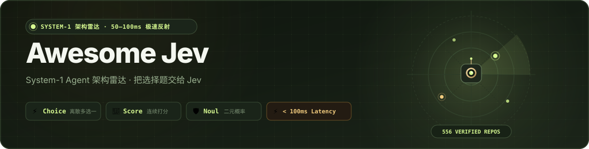

<div align="center">

<a href="https://logicrw.github.io/awesome-jev-projects/"></a>

# Awesome Jev — System-1 Agent 架构雷达

<p align="center">
  <a href="https://awesome.re"></a>
  <a href="https://logicrw.github.io/awesome-jev-projects/"></a>
  <a href="#分类"></a>
  <a href="LICENSE"></a>
  <a href="https://github.com/logicrw/awesome-jev-projects/issues/new?template=project.yml"></a>
</p>

<p align="center">
  <b>简体中文</b> &nbsp;•&nbsp; <a href="README.md">English</a> &nbsp;•&nbsp; <a href="README.ja.md">日本語</a> &nbsp;•&nbsp; <a href="README.ko.md">한국어</a>
</p>

<p align="center">
  <a href="https://logicrw.github.io/awesome-jev-projects/">🌐 <b>搜索与筛选 ↗</b></a> &nbsp;｜&nbsp; <a href="#agent-skill-接入">🤖 <b>Agent Skill 接入</b></a> &nbsp;｜&nbsp; <a href="#分类">📂 <b>分类</b></a> &nbsp;｜&nbsp; <a href="https://github.com/logicrw/awesome-jev-projects/issues/new?template=project.yml">🚀 <b>提交项目 (Issue 专用通道)</b></a>
</p>

> [!TIP]
> **📢 项目收录通道**：欢迎大家提交自己的 Jev 开源项目！为保障格式规范与自动化索引，本项目**统一通过 [Issue 专用模板](https://github.com/logicrw/awesome-jev-projects/issues/new?template=project.yml) 提交收录**，仓库**不接收 Pull Request**。填写仓库地址即可提交。

</div>

## 💡 **为什么关注 Jev 与 System-1 决策架构？**

构建自主智能体（Agent）时，如果把每一个分支选项都交给秒级响应的大推理模型（System 2），不仅**延迟高、成本高**，而且极易发生上下文漂移。

**TypeSafe Jev（System 1）** 是专门针对离散选择、连续打分与概率优化的百毫秒级决策模型：
- ⚡ **百毫秒内极速返回**：50–100ms 快速完成判定，保障 Agent 主循环高频敏捷。
- 🎯 **原生确定性输出**：原生支持 `Choice`（多选一）、`Score`（打分）与 `Noul`（二元逻辑与概率），免去易碎的正则提取。
- 🛡️ **严格拒绝概念炒作**：全网严选 **327+** 个绑定真实公开开源源码版本的落地项目，覆盖 17 大核心工程赛道。

### 📊 架构分工对比：System 1 (Jev) vs System 2 (大推理模型)

| 核心维度 | System 2（大推理模型） | TypeSafe Jev（System 1 决策模型） |
| :--- | :--- | :--- |
| **响应时延** | 1,500ms – 5,000ms+（秒级高延迟） | **50ms – 100ms（百毫秒极速反射）** |
| **输出结构** | 自由文本 / 易损坏的 JSON 正则提取 | **原生强类型 `Choice`、`Score`、`Noul`** |
| **Token 成本** | 高昂（$1.00 – $15.00 / 1M tokens） | **极轻量（仅占常规调用的极小零头）** |
| **上下文稳定性** | 易产生幻觉、长对话注意力漂移 | **确定性状态输入，零格式幻觉** |
| **工程核心职责** | 宏观规划、长文本总结、开放生成 | **工具路由、动作选择、安全门禁、高频循环** |

### 🎮 探索功能一览

- 🎰 **实体机械卡牌分发仓**：探索 Jev 原生决策点，支持连击抽卡计数与**逢 10 抽全屏粒子大烟花（💥 嘣！）**。
- ⚡ **毫秒级吸顶搜索与浮动过滤**：即便页面下滑，也可随时唤出浮动分类面板，支持多标签一键点选过滤。
- 🔍 **100% 绑定固定源码**：所有收录项目均核验真实 commit SHA 与具体接入点，绝无空气包装与死链。

> **[搜索与筛选 ↗](https://logicrw.github.io/awesome-jev-projects/)** · **327 个精选项目**

由社区维护的 Jev 项目与架构雷达，收录具有公开源码与清晰集成逻辑的开源项目，帮助开发者快速探索和落地 System-1 决策架构。

所有条目均已核对公开源码与实际决策逻辑，便于参考与选型。协议兼容实现会明确注明底层模型。

各项目遵循原仓库的开源许可证；特殊或未声明许可已单独注明。

## 赞助合作 · 付费展示

首发合作伙伴招募中，目前没有付费赞助商。

[查看合作方案与联系方式](https://github.com/logicrw/awesome-jev-projects/blob/main/SPONSORING.md) · [Sponsors](https://github.com/logicrw/awesome-jev-projects/blob/main/SPONSORS.md)

赞助不影响收录审核、项目描述或自然排序。

## Agent Skill 接入

安装官方技能后，可在终端或 Agent 中按赛道检索项目、读取固定版本源码证据与决策逻辑。

```bash
npx skills add logicrw/awesome-jev-projects
npx skills add https://logicrw.github.io/awesome-jev-projects/
```

[Agent Skill](https://logicrw.github.io/awesome-jev-projects/skill.md) · [llms.txt](https://logicrw.github.io/awesome-jev-projects/llms.txt) · [llms-full.txt](https://logicrw.github.io/awesome-jev-projects/llms-full.txt)

## 分类

- [浏览器与桌面 (26)](https://logicrw.github.io/awesome-jev-projects/categories/browser-os-action/)
- [命令行与流水线 (15)](https://logicrw.github.io/awesome-jev-projects/categories/cli-pipelines/)
- [分类与目录 (2)](https://logicrw.github.io/awesome-jev-projects/categories/classification-taxonomy/)
- [代码与图谱 (11)](https://logicrw.github.io/awesome-jev-projects/categories/codebase-graph-pathfinding/)
- [上下文与记忆 (20)](https://logicrw.github.io/awesome-jev-projects/categories/context-gc-filter/)
- [音乐与界面创作 (11)](https://logicrw.github.io/awesome-jev-projects/categories/creative-tools/)
- [数据与搜索 (17)](https://logicrw.github.io/awesome-jev-projects/categories/data-search/)
- [决策工具 (12)](https://logicrw.github.io/awesome-jev-projects/categories/decision-tools/)
- [行业应用 (21)](https://logicrw.github.io/awesome-jev-projects/categories/domain-vertical-tools/)
- [评测与观测 (29)](https://logicrw.github.io/awesome-jev-projects/categories/evaluation-observability/)
- [游戏与实时决策 (28)](https://logicrw.github.io/awesome-jev-projects/categories/high-frequency-simulation/)
- [MCP 与集成 (18)](https://logicrw.github.io/awesome-jev-projects/categories/mcp-integrations/)
- [模型路由与降本 (25)](https://logicrw.github.io/awesome-jev-projects/categories/routing-cost-optimization/)
- [SDK 与决策框架 (59)](https://logicrw.github.io/awesome-jev-projects/categories/sdk-decision-frameworks/)
- [SDK 与兼容接入 (6)](https://logicrw.github.io/awesome-jev-projects/categories/sdk-integrations/)
- [安全与内容审核 (23)](https://logicrw.github.io/awesome-jev-projects/categories/security-guardrails/)
- [语音与对话 (4)](https://logicrw.github.io/awesome-jev-projects/categories/voice-conversation/)

## 浏览器与桌面

- [**cua**](https://github.com/trycua/cua) — Cua 仓库的 jev-use 预览示例：Driver 观察与执行，Jev 从有界候选中选择浏览器动作。
  - **Jev 在哪一步做判断**: 读取 DOM 或可用的视觉区域描述，仅返回已提供的候选动作 ID。
  - **这个项目的用途**: 提供 Python、TypeScript 循环，以及离线与在线分开的验证路径。
  - [项目详情与固定源码](https://logicrw.github.io/awesome-jev-projects/projects/trycua/cua/) · 许可证: MIT

- [**jev-ultrafast**](https://github.com/browser-use/jev-ultrafast) — 给浏览器一个目标，让 Jev 选择操作和页面控件，需要输入文字时再调用文本模型。
  - **Jev 在哪一步做判断**: 根据当前 DOM，在一次请求里选择操作和相应控件；文本模型负责生成输入内容。
  - **这个项目的用途**: 把界面选择、文字生成与浏览器执行分开，方便查看每一步。
  - [项目详情与固定源码](https://logicrw.github.io/awesome-jev-projects/projects/jev-ultrafast/) · 许可证: MIT

- [**jev-desktop**](https://github.com/lahfir/agent-desktop) — 把电脑里的按钮和菜单交给 Jev 来选。它读原生无障碍结构，一步步完成桌面操作。
  - **Jev 在哪一步做判断**: Jev 同时选择动作与目标，并评估置信度和操作风险；本地策略决定是否执行或停止。
  - **这个项目的用途**: 让主 Agent 不必把整棵界面树塞进上下文。
  - [项目详情与固定源码](https://logicrw.github.io/awesome-jev-projects/projects/jev-desktop/) · 许可证: Apache-2.0

- [**omg.dev**](https://github.com/BennyKok/omg.dev) — omg.dev 的移动端测试脚本可让 Jev 读取可访问性树并选择下一步交互。
  - **Jev 在哪一步做判断**: 判断要操作的控件、步骤是否完成或是否受阻，再由测试执行器操作界面。
  - **这个项目的用途**: 给移动端测试加入基于当前界面状态的选择。
  - [项目详情与固定源码](https://logicrw.github.io/awesome-jev-projects/projects/bennykok/omg.dev/) · 许可证: MIT

- [**typesafe-computer-use**](https://github.com/awlevin/typesafe-computer-use) — 用 OCR 和界面状态构造候选动作，让 Jev 决定如何操作 macOS，需要写文字时再调用文本模型。
  - **Jev 在哪一步做判断**: 从确定性提取的控件与动作中选择下一步，执行器操作桌面。
  - **这个项目的用途**: 把屏幕读取、动作选择与文本生成分开。
  - [项目详情与固定源码](https://logicrw.github.io/awesome-jev-projects/projects/awlevin/typesafe-computer-use/) · 许可证: MIT

- [**mobile-jev**](https://github.com/droidrun/mobile-jev) — 通过 Mobilerun 控制 Android 手机，网页面板与命令行可查看 Jev 的操作过程。
  - **Jev 在哪一步做判断**: 根据手机界面选择应用、控件和下一步动作，Mobilerun 执行操作。
  - **这个项目的用途**: 记录动作轨迹与请求时延，便于检查手机任务的执行过程。
  - [项目详情与固定源码](https://logicrw.github.io/awesome-jev-projects/projects/droidrun/mobile-jev/) · 许可证: MIT

- [**jev-browser-use**](https://github.com/wy-coliney/jev-browser-use) — 给 Codex 浏览器工作流加一个 Skill：Jev 选导航、点击和滚动，Codex 保留文字输入与最终核验。
  - **Jev 在哪一步做判断**: 将页面状态与可执行候选交给 Jev，现有浏览器连接负责执行动作。
  - **这个项目的用途**: 把重复的页面选择交给独立决策步骤，复用已有浏览器连接。
  - [项目详情与固定源码](https://logicrw.github.io/awesome-jev-projects/projects/wy-coliney/jev-browser-use/) · 许可证: MIT

- [**jev-browser**](https://github.com/jkudish/jev-browser) — 给定任务与网址后驱动浏览器，返回最终页面、截图和逐步操作记录。
  - **Jev 在哪一步做判断**: 从 DOM 控件选择点击、输入、选择或滚动，并判断目标是否完成、流程是否卡住。
  - **这个项目的用途**: 把动作建议、实际执行与停止原因留在可检查的轨迹中。
  - [项目详情与固定源码](https://logicrw.github.io/awesome-jev-projects/projects/jkudish/jev-browser/) · 许可证: MIT

- [**jev-voice-browser**](https://github.com/moritzkremb/jev-voice-browser) — 用语音控制 Playwright 浏览器，将逐步转写的口令交给 Jev 判断。
  - **Jev 在哪一步做判断**: 选择意图、元素、网址或原文片段，并判断口令是否完整、是否涉及敏感动作。
  - **这个项目的用途**: 界面显示概率、动作与请求时间，便于观察语音交互。
  - [项目详情与固定源码](https://logicrw.github.io/awesome-jev-projects/projects/moritzkremb/jev-voice-browser/) · 许可证: MIT

- [**typesafe-adblock**](https://github.com/realZachi/typesafe-adblock) — 一个实验性 Chrome 扩展，让 Jev 判断候选 DOM 元素是否是广告，再高亮或移除。
  - **Jev 在哪一步做判断**: 对元素文本、标签和链接等信息批量询问 Noul，按阈值应用页面操作。
  - **这个项目的用途**: 展示语义判断如何连接到具体页面元素。
  - [项目详情与固定源码](https://logicrw.github.io/awesome-jev-projects/projects/realzachi/typesafe-adblock/) · 许可证: MIT

- [**Jev-cu**](https://github.com/Sac-Y/Jev-cu) — Codex Computer Use 辅助循环：界面文字候选交给 Jev，读取与执行交给桌面工具。
  - **Jev 在哪一步做判断**: 选择元素、动作、完成度和风险，本地策略决定执行、停止或要求确认。
  - **这个项目的用途**: 以文字候选表达判断输入，默认先 dry-run。
  - [项目详情与固定源码](https://logicrw.github.io/awesome-jev-projects/projects/sac-y/jev-cu/) · 许可证: 未声明

- [**jev-browser**](https://github.com/Ying-Kai-Liao/jev-browser) — 浏览器自动化库、CLI 和 MCP：调用方模型给出目标与待输入文字，Jev 选择具体操作。
  - **Jev 在哪一步做判断**: 从页面候选中选择元素、动作和值，并评估完成、错误与不可逆操作。
  - **这个项目的用途**: 把浏览器动作循环与调用方规划分开，并返回状态与轨迹。
  - [项目详情与固定源码](https://logicrw.github.io/awesome-jev-projects/projects/ying-kai-liao/jev-browser/) · 许可证: MIT

- [**jev-macos-loop**](https://github.com/jcpsimmons/jev-macos-loop) — 在 Mac 本地识别屏幕文字和控件，把文字选项交给 Jev，再点击它选中的元素。
  - **Jev 在哪一步做判断**: Jev 从本地视觉、OCR 与无障碍标签组成的有限元素列表中选择；坐标和输入执行留在 Mac。
  - **这个项目的用途**: 让原生界面点击使用可枚举目标，并在执行前复核焦点与元素状态。
  - [项目详情与固定源码](https://logicrw.github.io/awesome-jev-projects/projects/jcpsimmons/jev-macos-loop/) · 许可证: AGPL-3.0

- [**jev-ego**](https://github.com/romaluev/jev-ego) — 面向 ego lite 的浏览器 Agent，把页面可操作元素编号后交给 Jev 选择下一步。
  - **Jev 在哪一步做判断**: Jev 在一次请求中选择操作及目标；需要自由文本时使用单独的文字辅助模型。
  - **这个项目的用途**: 提供观察、建议和执行入口；上传、弹窗等能力仍需其他浏览器工具。
  - [项目详情与固定源码](https://logicrw.github.io/awesome-jev-projects/projects/romaluev/jev-ego/) · 许可证: MIT

- [**AskJev**](https://github.com/ranjan2829/AskJev) — 通过 MCP 把 Agent 接到浏览器，由 Jev 选择网页动作，并对付款、删除等操作设置确认环节。
  - **Jev 在哪一步做判断**: 从当前网页控件中选动作，并评估操作风险与不可逆程度。
  - **这个项目的用途**: 把自动操作与用户确认放在同一工作流中。
  - [项目详情与固定源码](https://logicrw.github.io/awesome-jev-projects/projects/ranjan2829/askjev/) · 许可证: MIT

- [**computer-use-jev**](https://github.com/paulsmith/computer-use-jev) — 用 Go 控制 macOS 应用，让 Jev 从可访问性树里选择控件和操作。
  - **Jev 在哪一步做判断**: 根据窗口状态选择动作、目标、是否输入文字以及任务是否结束。
  - **这个项目的用途**: 候选控件来自界面快照，可以回看选择过程。
  - [项目详情与固定源码](https://logicrw.github.io/awesome-jev-projects/projects/paulsmith/computer-use-jev/) · 许可证: MIT

- [**jev-browser**](https://github.com/tontoko/jev-browser) — 基于 Playwright 的 Jev 浏览器自动化工具，共用 CLI、MCP 与 TypeScript SDK。
  - **Jev 在哪一步做判断**: Jev 从页面观测中选择操作、匹配表单字段或提取结构化内容，Playwright 执行。
  - **这个项目的用途**: 支持持久会话与页面结果回读；回读不等于已验证数据库持久化。
  - [项目详情与固定源码](https://logicrw.github.io/awesome-jev-projects/projects/tontoko/jev-browser/) · 许可证: Apache-2.0

- [**jev-shield**](https://github.com/vmendes90/jev-shield) — 一个 Chrome 广告过滤扩展，用 Jev 判断信息流元素是否带有推广意图。
  - **Jev 在哪一步做判断**: 把候选 DOM 元素分批发送到 TypeSafe，以 Noul 概率配合阈值决定是否折叠。
  - **这个项目的用途**: 在本地广告规则之外增加基于文字含义的判断。
  - [项目详情与固定源码](https://logicrw.github.io/awesome-jev-projects/projects/vmendes90/jev-shield/) · 许可证: MIT

- [**aside-jev**](https://github.com/himomohi/aside-jev) — 给 Aside 浏览器 Agent 提供 Jev 判断的 MCP 服务器与 skill。
  - **Jev 在哪一步做判断**: Agent 列出候选动作，Jev 选择候选 ID，再由 Agent 通过 Aside 执行并复核。
  - **这个项目的用途**: 把模型选择限制在应用给出的动作表内，执行结果仍需另行验证。
  - [项目详情与固定源码](https://logicrw.github.io/awesome-jev-projects/projects/himomohi/aside-jev/) · 许可证: MIT

- [**jev-clerk**](https://github.com/stas4000/jev-clerk) — 在 macOS 桌面上把供应商发票录入会计软件：Jev 每步从封闭动作表里选点击对象，深度模型只改剧本。
  - **Jev 在哪一步做判断**: POST \`https://api.typesafe.ai/v1/systemone\`，默认 \`jev-latest\`，每步做封闭动作 Choice。
  - **这个项目的用途**: 屏幕动作由 Jev 的封闭选择驱动；作者演示数字未经本站复测。GitHub SPDX 为空，LICENSE 文件是 MIT。
  - [项目详情与固定源码](https://logicrw.github.io/awesome-jev-projects/projects/stas4000/jev-clerk/) · 许可证: MIT

- [**JevFilterForX**](https://github.com/grayrepo-byte/jev_filter_for_x) — JevFilterForX 是一个用于 X 的浏览器扩展。它会为信息流中的帖子评分，用轻量标签解释评分，并根据你的过滤设置折叠内容。未配置 API Key 时，默认使用本地模拟评分。
  - **Jev 在哪一步做判断**: Jev 用 Choice 分类、Score 评估信息量、可行动性与原创性，用 Noul 打标签；本地阈值和噪声规则决定是否折叠帖子。
  - **这个项目的用途**: 把评分、标签和可调整的过滤阈值放进 X 信息流，折叠后仍可展开或再次隐藏帖子及其媒体附件。
  - [项目详情与固定源码](https://logicrw.github.io/awesome-jev-projects/projects/grayrepo-byte/jev_filter_for_x/) · 许可证: 未声明

- [**jevis**](https://github.com/jaewgwon/jevis) — Flutter integration\_test 包：注册允许的 UI 动作，Jev 根据当前界面选下一步并判断目标是否达成。
  - **Jev 在哪一步做判断**: 默认 \`jev-latest\` 向 \`/v1/systemone\` POST：目标是 Noul，下一步是已注册动作上的 Choice。
  - **这个项目的用途**: 把自然语言测试收成封闭动作表上的选择，而不是让模型自由点屏幕。
  - [项目详情与固定源码](https://logicrw.github.io/awesome-jev-projects/projects/jaewgwon/jevis/) · 许可证: Apache-2.0

- [**cline-plugin-jev-browser**](https://github.com/abeatrix/cline-plugin-jev-browser) — Cline 的独立 Playwright 浏览器插件，通过 Vercel AI Gateway 用 Jev 选择网页操作。
  - **Jev 在哪一步做判断**: Jev 读取 DOM 目标表选择动作；需输入文字时由另外的文本模型生成。
  - **这个项目的用途**: 保存操作前后截图并在敏感动作前交还控制；完成状态仍需回读验证。
  - [项目详情与固定源码](https://logicrw.github.io/awesome-jev-projects/projects/abeatrix/cline-plugin-jev-browser/) · 许可证: 未声明

- [**ego-jev**](https://github.com/phd-peter/ego-jev) — 把 Ego Lite 的浏览器快照与操作接到一个有步骤上限的 Jev 决策循环。
  - **Jev 在哪一步做判断**: 只从当前快照的候选元素和支持动作中选择；输入文字时可调用另一个模型。
  - **这个项目的用途**: 用当前快照的引用执行动作，并记录每步状态。
  - [项目详情与固定源码](https://logicrw.github.io/awesome-jev-projects/projects/phd-peter/ego-jev/) · 许可证: MIT

- [**jev-tweet-radar**](https://github.com/DDnim/jev-tweet-radar) — Chrome 扩展对 X 时间线里每条帖子发一次 Jev Noul 请求，显示互动价值和可选标签概率。
  - **Jev 在哪一步做判断**: 一次 System One 请求里对“是否值得互动”以及 spam、buzz、AI 等内容标签做 Noul。
  - **这个项目的用途**: 把时间线筛选做成可检查的概率，而不是生成评论文本。帖子正文会发到 TypeSafe。
  - [项目详情与固定源码](https://logicrw.github.io/awesome-jev-projects/projects/ddnim/jev-tweet-radar/) · 许可证: MIT

- [**JevBrowserExt**](https://github.com/chy4pro/JevBrowserExt) — 把 jev-ultrafast 做成 Manifest V3 Chrome 扩展：Jev 在当前标签里选操作和 DOM 元素，只有输入文字时才调用小型对话模型。
  - **Jev 在哪一步做判断**: 一次请求选择 CLICK、TYPE\_TEXT、SELECT、SCROLL\_DOWN、SCROLL\_UP、PRESS\_ENTER、WAIT、DONE 或 BLOCKED 以及对应元素；PRESS\_ENTER 是独立按键控件。另用独立是非题核对目标是否已达成、动作是否卡住。
  - **这个项目的用途**: 在用户自己的标签里跑，不截图；操作、目标元素和输入文案可以分开检查。
  - [项目详情与固定源码](https://logicrw.github.io/awesome-jev-projects/projects/chy4pro/jevbrowserext/) · 许可证: MIT


## 命令行与流水线

- [**foreman**](https://github.com/thruwire/foreman) — 独立监督环读取编码工人的 diff、日志和测试，用 Jev Noul 判断卡住、跑偏、该验证，再由 Python 策略干预。
  - **Jev 在哪一步做判断**: \`AsyncTypeSafeClient.system\_one\`，默认 \`jev-latest\`，对监督问题发 Noul。
  - **这个项目的用途**: 监督不代替工人写代码；与目录里的 \`Shifty-Eye-Games/foreman-jev\` 不是同一个仓库。
  - [项目详情与固定源码](https://logicrw.github.io/awesome-jev-projects/projects/thruwire/foreman/) · 许可证: MIT

- [**orchestkit**](https://github.com/yonatangross/orchestkit) — OrchestKit 可选用 Jev 给编程会话分类，符合阈值时用结果决定会话颜色。
  - **Jev 在哪一步做判断**: 将首条任务提示与分支状态分类为开发、排错等工作类型；本地规则选择采用或回退。
  - **这个项目的用途**: 用工作类型区分会话，同时保留 shadow 对照模式。
  - [项目详情与固定源码](https://logicrw.github.io/awesome-jev-projects/projects/yonatangross/orchestkit/) · 许可证: MIT

- [**jev-shell-history**](https://github.com/mrnugget/jev-shell-history) — 类似于 Fish 终端样式的 Zsh 历史命令建议工具，利用 Jev 对已有历史记录根据当前上下文进行智能打分排序。
  - **Jev 在哪一步做判断**: 将当前敲入的命令前缀与本地 Zsh 历史候选组装为 Jev 请求，由 Jev 评估最佳补全项，仅做行内建议而不自动执行。
  - **这个项目的用途**: 结合了确定性本地历史的安全性与 Jev 上下文语义理解能力，避免盲目基于字符串前缀匹配造成的低质建议。
  - [项目详情与固定源码](https://logicrw.github.io/awesome-jev-projects/projects/mrnugget/jev-shell-history/) · 许可证: 未声明

- [**jev-axi**](https://github.com/shiftynick/jev-axi) — 在命令行调用 Jev 做 pick、rate、check、rank、triage、guard，并可接到 Agent 工具调用前的 hook。
  - **Jev 在哪一步做判断**: 把输入状态和选项转为结构化问题，返回结果或供本地安全策略使用的风险分数。
  - **这个项目的用途**: 在脚本和 Agent 工作流里复用同一套判断命令。
  - [项目详情与固定源码](https://logicrw.github.io/awesome-jev-projects/projects/shiftynick/jev-axi/) · 许可证: MIT

- [**rift**](https://github.com/exYze/rift) — Rust 编程终端 Rift 的可选 TypeSafe 决策客户端，给受限判断调用 Jev。
  - **Jev 在哪一步做判断**: 向 System One 提交状态和类型化问题，解析答案供终端工作流使用。
  - **这个项目的用途**: 在生成式编程模型之外接入独立的判断接口。
  - [项目详情与固定源码](https://logicrw.github.io/awesome-jev-projects/projects/exyze/rift/) · 许可证: MIT

- [**SemDecide**](https://github.com/sharziki/semdecide) — 基于 Python 的语义判断 CLI，可给文本或 JSONL 管道做判断、分类、打分和过滤。
  - **Jev 在哪一步做判断**: 将输入交给 Jev，按返回概率与本地阈值生成结果及退出码。
  - **这个项目的用途**: 把结构化判断接进 Bash 和 CI，保留明确的输出与失败状态。
  - [项目详情与固定源码](https://logicrw.github.io/awesome-jev-projects/projects/semdecide/) · 许可证: MIT

- [**jev-cli**](https://github.com/tumf/jev-cli) — 为 Jev 提供 CLI 和 stdio MCP 入口，输入文本或 JSON，输出结构化判断。
  - **Jev 在哪一步做判断**: 向 Jev 提交 noul、choice、score 问题，将结果输出为 JSON 或单个值。
  - **这个项目的用途**: 支持文件和 stdin 输入，可接入 Shell 脚本或 MCP 客户端。
  - [项目详情与固定源码](https://logicrw.github.io/awesome-jev-projects/projects/tumf/jev-cli/) · 许可证: MIT

- [**jev-cli**](https://github.com/Nasrallah-AL/jev-cli) — 名为 jevctl 的终端工具，把核验、分类与评分问题接到文本输入和脚本里。
  - **Jev 在哪一步做判断**: 把输入与固定答案集合发给 Jev，再按本地阈值输出判断和概率。
  - **这个项目的用途**: 提供可用于管道和 CI 的结构化结果，也支持检查请求和 dry-run。
  - [项目详情与固定源码](https://logicrw.github.io/awesome-jev-projects/projects/nasrallah-al/jev-cli/) · 许可证: MIT

- [**jev-code**](https://github.com/rhighs/jev-code) — 一个实验性编程终端，让 Jev 逐步选择 AST 节点来组成 Python 或 Bash，也能作为命令行判断工具。
  - **Jev 在哪一步做判断**: 从有限的语法与动作选项中选择，由本地程序生成代码或执行工具。
  - **这个项目的用途**: 把编程选择和命令行判断过程显示为可回看的记录。
  - [项目详情与固定源码](https://logicrw.github.io/awesome-jev-projects/projects/rhighs/jev-code/) · 许可证: 未声明

- [**jev-cli**](https://github.com/jtsang4/jev-cli) — 在终端里问 Jev 判断题。输入文本或 JSON，再给出分类、是非或评分问题，拿回脚本能直接读取的 JSON。
  - **Jev 在哪一步做判断**: 针对同一份输入做分类、真假判断和分级评分，返回选项及其概率。
  - **这个项目的用途**: 能接收标准输入，把语义校验接进已有脚本和 CI；支持直连 TypeSafe 或走 Vercel 网关。
  - [项目详情与固定源码](https://logicrw.github.io/awesome-jev-projects/projects/jtsang4/jev-cli/) · 许可证: MIT

- [**jev-superpowers**](https://github.com/AkashPriyadarshii/jev-superpowers) — 面向编码智能体的系统化开发流程框架，融合 Jev 进行无幻觉依赖审查、完成度门禁与错误重试决策。
  - **Jev 在哪一步做判断**: 在智能体执行循环的关键检查点，利用 Jev 评估代码变更质量、测试覆盖与第三方包合法性，决定是否推进或回滚。
  - **这个项目的用途**: 将确定性代码流水线与 Jev 快速二元判断结合，防止编码 Agent 在长程任务中产生方向偏离或引入未知包。
  - [项目详情与固定源码](https://logicrw.github.io/awesome-jev-projects/projects/akashpriyadarshii/jev-superpowers/) · 许可证: MIT

- [**pr-sieve**](https://github.com/Thestral12/pr-sieve) — GitHub Action 把 \`.jev.yml\` 规则编译成 Jev 问题，按数值决定 fail、comment 或 pass。
  - **Jev 在哪一步做判断**: 规则编成最多 12 个问题（\`src/types.ts\` 的 \`MAX\_JEV\_QUESTIONS\`）；\`AKIA…\` 与私钥装甲由 \`src/redact.ts\` 命中后，\`src/pipeline.ts\` 本地失败且不调用 Jev。
  - **这个项目的用途**: 不写审查文、不给补丁、不自动批准；策略读自 base 分支配置。
  - [项目详情与固定源码](https://logicrw.github.io/awesome-jev-projects/projects/thestral12/pr-sieve/) · 许可证: MIT

- [**TypeSafe AI Playground**](https://github.com/markjaquith/typesafe-ai-playground) — Rust 命令行实验集，可筛查医疗隐私信息、检查代码注释、分析语气并分类行业和职业。
  - **Jev 在哪一步做判断**: 把输入文本交给 Jev，返回独立的 Noul 概率、Score 或候选分类。
  - **这个项目的用途**: 提供可直接查看结构化结果的终端实验入口。
  - [项目详情与固定源码](https://logicrw.github.io/awesome-jev-projects/projects/typesafe-ai-playground/) · 许可证: MIT

- [**jevscript**](https://github.com/amberwhitehead/jevscript) — 把语义判断作为语言原语的早期实验，目前实现的是 Jev 请求批处理验证脚本。
  - **Jev 在哪一步做判断**: 脚本比较单独与合并问题的回答、用量和延迟；完整语言引擎仍是设计目标。
  - **这个项目的用途**: 适合研究请求批处理，不应当作已完成的编译器或解释器。
  - [项目详情与固定源码](https://logicrw.github.io/awesome-jev-projects/projects/amberwhitehead/jevscript/) · 许可证: 未声明

- [**slopcheck-jev**](https://github.com/harshpuri84/slopcheck-jev) — slopcheck-jev 在终端和自动化脚本中加入文本判断。
  - **Jev 在哪一步做判断**: 对输入文本做分类或打分，交给本地规则继续处理。
  - **这个项目的用途**: 把语义判断接到已有的命令行工作流。
  - [项目详情与固定源码](https://logicrw.github.io/awesome-jev-projects/projects/harshpuri84/slopcheck-jev/) · 许可证: MIT


## 分类与目录

- [**typesafe-jev-workflow**](https://github.com/GiesN/typesafe-jev-workflow) — 一个异步 LangGraph 示例：让 Jev 把模拟邮件分成发票事务和普通邮件。
  - **Jev 在哪一步做判断**: Jev 返回 invoice 或 general，图节点据此选择示例处理分支。
  - **这个项目的用途**: 把模型分类和本地工作流路由分开，方便检查每步结果。
  - [项目详情与固定源码](https://logicrw.github.io/awesome-jev-projects/projects/giesn/typesafe-jev-workflow/) · 许可证: 未声明

- [**jev-tree**](https://github.com/reachjalil/jev-tree) — 选项太多，一次问不下？先把目录分成树，让 Jev 逐层选分支，最后落到具体商品、事件类型或工作流。
  - **Jev 在哪一步做判断**: 每次只在当前层的候选分支里做单选，再沿选中的分支继续查找。
  - **这个项目的用途**: 不用直接截掉大目录尾部的候选，还能返回完整选择路径；失败时明确报告不可用。
  - [项目详情与固定源码](https://logicrw.github.io/awesome-jev-projects/projects/reachjalil/jev-tree/) · 许可证: MIT


## 代码与图谱

- [**celesto**](https://github.com/CelestoAI/celesto) — Celesto 的 PR 审查示例在沙盒中准备检查，再比较普通模型与 Jev 对候选问题的判断。
  - **Jev 在哪一步做判断**: 检查疑似问题是否由当前变更引入、是否有证据、是否值得修复。
  - **这个项目的用途**: 将执行记录与评估结果放在同一审查界面中。
  - [项目详情与固定源码](https://logicrw.github.io/awesome-jev-projects/projects/celestoai/celesto/) · 许可证: Apache-2.0

- [**Jev Review**](https://github.com/devagrawal09/jev-review) — 分阶段检查 Git diff 或整个代码库，在本地面板里展示可复核的审查线索。
  - **Jev 在哪一步做判断**: 依次判断风险、文件、证据片段、问题机制和严重程度，再按规则选择审查路径。
  - **这个项目的用途**: 把审查线索关联到具体代码，便于人工复核。
  - [项目详情与固定源码](https://logicrw.github.io/awesome-jev-projects/projects/jev-review/) · 许可证: MIT

- [**commit-miner**](https://github.com/devanshbatham/commit-miner) — 用 Jev 给 Git commit 的日志和 diff 分类，整理 bug 修复、安全修复、CWE 与改动类型。
  - **Jev 在哪一步做判断**: 对提交内容询问固定类别问题，保存结果供过滤和 HTML/CSV 报告使用。
  - **这个项目的用途**: 把大量提交整理成便于进一步核查的分类记录。
  - [项目详情与固定源码](https://logicrw.github.io/awesome-jev-projects/projects/devanshbatham/commit-miner/) · 许可证: 未声明

- [**neo4jev**](https://github.com/jexp/neo4jev) — 在 Neo4j 图谱里逐步找关系，让 Jev 在每个节点选择下一条边。
  - **Jev 在哪一步做判断**: Choice 为相邻关系分配概率，Noul 判断是否到达目标，本地 beam search 保留候选路径。
  - **这个项目的用途**: 把自然语言目标对应到可以查看的图谱路径。
  - [项目详情与固定源码](https://logicrw.github.io/awesome-jev-projects/projects/neo4jev/) · 许可证: MIT

- [**Blink**](https://github.com/ellipsis-dev/blink) — 用自然语言查找文件：多个 walker 沿目录树逐层搜索。
  - **Jev 在哪一步做判断**: Jev 评估文件和目录名的相关概率，程序据此分配 walker。
  - **这个项目的用途**: 不先建向量索引；结果展示各路径获得的 walker 比例。
  - [项目详情与固定源码](https://logicrw.github.io/awesome-jev-projects/projects/blink/) · 许可证: 未声明

- [**jev-code**](https://github.com/devagrawal09/jev-code) — 给编程 Agent 提供代码定位、改动意图检查、测试失败整理和审查意见分流。
  - **Jev 在哪一步做判断**: 在固定工作流中选择任务，对有限的 diff、代码或日志片段做结构化判断。
  - **这个项目的用途**: 返回下一步可检查的线索，同时说明未检查的范围。
  - [项目详情与固定源码](https://logicrw.github.io/awesome-jev-projects/projects/devagrawal09/jev-code/) · 许可证: MIT

- [**jev**](https://github.com/BorisLeMeec/jev) — Go 编写的 Claude Code 插件，用 Jev 查找相关文件、跨文件回答有界问题并处理大段读取。
  - **Jev 在哪一步做判断**: 根据问题筛选与验证代码相关性，减少直接送入 Agent 的整文件内容。
  - **这个项目的用途**: 返回可定位的文件线索和判断结果。
  - [项目详情与固定源码](https://logicrw.github.io/awesome-jev-projects/projects/borislemeec/jev/) · 许可证: MIT

- [**leanest**](https://github.com/baronunread/leanest) — 在现有测试运行器前增加 Jev 筛选，根据 diff 和测试源码判断哪些测试应运行。
  - **Jev 在哪一步做判断**: Jev 评估测试与变更的关系，本地策略在不确定、调用失败或测试文件改动时选择运行。
  - **这个项目的用途**: 可用 shadow 模式对比建议；选择结果不能保证没有漏测。
  - [项目详情与固定源码](https://logicrw.github.io/awesome-jev-projects/projects/baronunread/leanest/) · 许可证: MIT

- [**claude-jev**](https://github.com/buchmark/claude-jev) — 给 Claude Code 的审查发现、排错假设、设计方案和代码搜索结果增加一次 Jev 复核。
  - **Jev 在哪一步做判断**: 对候选缺陷、解释或选项按预设问题打分，再由阈值与本地策略处理。
  - **这个项目的用途**: 把第二次判断及概率保留下来，便于检查分歧。
  - [项目详情与固定源码](https://logicrw.github.io/awesome-jev-projects/projects/buchmark/claude-jev/) · 许可证: MIT

- [**jev-review-action**](https://github.com/fatwang2/jev-review-action) — 可配置的 GitHub Action，用 Jev 检查目录投稿或给 PR 分类，并更新模板评论。
  - **Jev 在哪一步做判断**: 依据固定版本仓库材料或 PR patch 回答策略问题，再由代码应用分类规则。
  - **这个项目的用途**: 把问题定义、阈值与评论格式留在可审查的配置中。
  - [项目详情与固定源码](https://logicrw.github.io/awesome-jev-projects/projects/fatwang2/jev-review-action/) · 许可证: MIT

- [**PiJ**](https://github.com/tonyzdev/PiJ) — 基于 Pi 的终端编码 Agent，主模型负责推理、改代码与工具调用，Jev 提供辅助判断。
  - **Jev 在哪一步做判断**: Jev 推荐 skill、重排真实源码候选并分类工具失败；不自动重试或批准权限。
  - **这个项目的用途**: 保留原始路径、行号、源码与错误输出；作者的有限实验不代表普遍收益。
  - [项目详情与固定源码](https://logicrw.github.io/awesome-jev-projects/projects/tonyzdev/pij/) · 许可证: MIT


## 上下文与记忆

- [**fast-jev-compaction**](https://github.com/tamaratran/fast-jev-compaction) — 为 Claude Code 删减旧工具调用和结果，保留留下来的原文，不另写摘要。
  - **Jev 在哪一步做判断**: 分别判断工具调用与完整结果是否仍需保留，本地规则执行保留、截短或删除。
  - **这个项目的用途**: 减少摘要改写对路径、命令和报错原文的影响。
  - [项目详情与固定源码](https://logicrw.github.io/awesome-jev-projects/projects/tamaratran/fast-jev-compaction/) · 许可证: MIT

- [**bluenoise**](https://github.com/rokcso/bluenoise) — 为 X/Twitter 过滤帖子与回复的浏览器扩展；默认用本地规则，可选择用 Jev 检查未匹配的回复。
  - **Jev 在哪一步做判断**: 启用实验性 AI 后，将未命中规则的回复交给 Jev 评估，再由本地阈值决定是否隐藏。
  - **这个项目的用途**: 先应用可逆的本地规则，只对需要的内容追加模型判断。
  - [项目详情与固定源码](https://logicrw.github.io/awesome-jev-projects/projects/rokcso/bluenoise/) · 许可证: MIT

- [**jev-pruner**](https://github.com/tamaratran/jev-pruner) — Claude Code 输出修剪插件，在 Bash 执行后、结果进入主模型前筛掉部分冗余文本。
  - **Jev 在哪一步做判断**: 满足长度与内容条件后，Jev 按块判断哪些输出应保留，原始内容另行归档。
  - **这个项目的用途**: 较短输出、错误和识别出的结构化或源码内容直接保留，避免把所有日志一刀切。
  - [项目详情与固定源码](https://logicrw.github.io/awesome-jev-projects/projects/tamaratran/jev-pruner/) · 许可证: MIT

- [**Winnow**](https://github.com/GhalebDweikat/winnow) — 给 Claude Code 的长日志装一道筛子。暂时不相关的内容先藏起来，想看时还能完整找回。
  - **Jev 在哪一步做判断**: 逐块判断 Read、Bash、Grep 输出是否有用；保留相关或不确定内容，隐藏高置信度无关块。
  - **这个项目的用途**: 减少进入上下文的冗余输出，并保留可召回的原文。
  - [项目详情与固定源码](https://logicrw.github.io/awesome-jev-projects/projects/winnow/) · 许可证: MIT

- [**yoshi**](https://github.com/compozy/yoshi) — 面向 Claude Code 与 Codex 的上下文剪枝代理，通过 Jev 评估历史条目必要性并保持工具调用协议结构完整。
  - **Jev 在哪一步做判断**: 在代理转发层使用 Jev 对消息历史打分，过滤已失效的中间试错输出，仅向大模型提交精简后的有效上下文。
  - **这个项目的用途**: 降低每次交互的输入 Token 数量，加快响应首字时间，且不破坏现有客户端与服务端的协议兼容性。
  - [项目详情与固定源码](https://logicrw.github.io/awesome-jev-projects/projects/compozy/yoshi/) · 许可证: MIT

- [**jevlogs**](https://github.com/reachjalil/jevlogs) — 在 OpenTelemetry 日志进入进一步分析前，用 Jev 标注诊断价值、优先级和路由信号。
  - **Jev 在哪一步做判断**: 按日志内容打分，判断是否值得送交更深入的模型分析。
  - **这个项目的用途**: 可把判断附在日志上，同时保留原归档路径。
  - [项目详情与固定源码](https://logicrw.github.io/awesome-jev-projects/projects/reachjalil/jevlogs/) · 许可证: MIT

- [**azdaja**](https://github.com/kubet/azdaja) — Azdaja 是与 harness 无关的递归语言模型层，将完整资料保存在本地求值器中并只对选定内容做语义递归，可配合 Jev 进行类型化语义判断。
  - **Jev 在哪一步做判断**: Jev 对选定的源码窗口就显式问题返回Noul/Choice/Score概率，供RLM决定下一步检查、合并或探索的内容。
  - **这个项目的用途**: 把语义判断接到已有的命令行工作流。
  - [项目详情与固定源码](https://logicrw.github.io/awesome-jev-projects/projects/kubet/azdaja/) · 许可证: MIT

- [**jev-use**](https://github.com/shitianfang/jev-use) — 把 Claude Code / Codex / pi 中不需要输出文本的判断步骤交给 Jev 执行，需要写字或置信度不足的步骤按类型化契约退回 LLM。
  - **Jev 在哪一步做判断**: \`judge()\`（第 35 行）把关于同一个 state 的多个 noul / choice / score 问题打成一次调用；\`toVerdict()\`（第 100~157 行）按原语分别处理 \`noul\`、\`choice\`、\`score\` 的答案与置信度。同文件的 \`gate()\`（第 170 行）是可选的 PreToolUse 门禁，只能 deny 或 ask。置信度不足或本就不该由 Jev 决定的步骤，通过类型化 escalation 契约（\`writing\`、\`open\_ended\`、\`oversized\`、\`unsure\`、\`unreachable\`）退回 LLM，而不是让 Jev 猜。
  - **这个项目的用途**: 减少后续处理的冗余信息。
  - [项目详情与固定源码](https://logicrw.github.io/awesome-jev-projects/projects/shitianfang/jev-use/) · 许可证: MIT

- [**pi-fast-jev-compaction**](https://github.com/joelhooks/pi-fast-jev-compaction) — Pi 扩展：清理过时工具历史，保留原文；不足以释放上下文时交给 Pi 原生摘要。
  - **Jev 在哪一步做判断**: 分别判断调用和结果是否保留，并在送给模型的上下文中执行过滤。
  - **这个项目的用途**: 保留原始会话文件，并记录每次删减决定。
  - [项目详情与固定源码](https://logicrw.github.io/awesome-jev-projects/projects/joelhooks/pi-fast-jev-compaction/) · 许可证: MIT

- [**elons-job**](https://github.com/bugkiwi/elons-job) — 本地优先的 Chrome 扩展：先用规则筛选 X 回复，再让 Jev 判断色情、性暗示和引流内容，并提供可恢复的隐藏占位符。
  - **Jev 在哪一步做判断**: 将 X 详情页回复编译为 Jev Noul 判断问题，由本地阈值、规则和重复模板信号共同决定是否隐藏。
  - **这个项目的用途**: 结合本地规则、缓存、并发与成本保护以及 Fail-Open 设计；不需要 X 官方 API，隐藏内容可以恢复。
  - [项目详情与固定源码](https://logicrw.github.io/awesome-jev-projects/projects/bugkiwi/elons-job/) · 许可证: 未声明

- [**fast-dev-compaction**](https://github.com/leonaaardob/fast-dev-compaction) — Codex 插件与上下文压缩工具，在会话生命周期钩子中利用 Jev 判定历史记录的保留价值并进行无损还原。
  - **Jev 在哪一步做判断**: 在会话上下文触达上限时，由 Jev 逐条评估历史消息和工具调用的保留必要性，仅剪除冗余噪音。
  - **这个项目的用途**: 相比简单的截断或整段摘要，通过离散判断保留了关键的代码定位与协议结构，防止长程编码对话失忆。
  - [项目详情与固定源码](https://logicrw.github.io/awesome-jev-projects/projects/leonaaardob/fast-dev-compaction/) · 许可证: MIT

- [**jev-skill-gate**](https://github.com/ShivamPansuriya/jev-skill-gate) — 按当前项目给 Claude Code 技能排相关度，减少默认加载的技能说明。
  - **Jev 在哪一步做判断**: 结合项目技术栈、目录与 README 判断技能相关性，再调整技能说明的可见程度。
  - **这个项目的用途**: 保留需要的说明，同时给其余技能保留手动调用入口。
  - [项目详情与固定源码](https://logicrw.github.io/awesome-jev-projects/projects/shivampansuriya/jev-skill-gate/) · 许可证: MIT

- [**omp-jev-compaction**](https://github.com/jerryfane/omp-jev-compaction) — 为 Oh My Pi 删减工具历史的扩展，保留原文并复用旧判断以减少前缀反复改写。
  - **Jev 在哪一步做判断**: Jev 判断工具调用和结果的保留价值，扩展据此截短并附上可恢复提示。
  - **这个项目的用途**: 将删减决策记下来，在后续请求中重复应用。
  - [项目详情与固定源码](https://logicrw.github.io/awesome-jev-projects/projects/jerryfane/omp-jev-compaction/) · 许可证: MIT

- [**pi-jev-context**](https://github.com/kevinpita/pi-jev-context) — Pi 的可逆上下文筛选扩展，用 Jev 判断旧消息是否仍值得发给主模型。
  - **Jev 在哪一步做判断**: 对历史片段做相关性判断，低分片段从后续请求隐藏，原始会话保留。
  - **这个项目的用途**: 可关闭筛选恢复完整上下文；启用时部分历史内容会发送给 TypeSafe。
  - [项目详情与固定源码](https://logicrw.github.io/awesome-jev-projects/projects/kevinpita/pi-jev-context/) · 许可证: MIT

- [**codex-jev-compaction**](https://github.com/Wang-auspicious/codex-jev-compaction) — 为 Codex 整理任务交接上下文，用 Jev 筛选旧工具记录，并保留选中内容的原文。
  - **Jev 在哪一步做判断**: 判断符合条件的只读工具记录是否相关，本地规则保护必须保留的内容并生成交接包。
  - **这个项目的用途**: 交接包保留来源、筛选理由和原文次序。
  - [项目详情与固定源码](https://logicrw.github.io/awesome-jev-projects/projects/wang-auspicious/codex-jev-compaction/) · 许可证: MIT

- [**jev-context**](https://github.com/zbush/jev-context) — Codex 代码搜索插件：ripgrep 找候选，Jev 过滤后只返回判为相关的片段。
  - **Jev 在哪一步做判断**: 对代码片段与当前问题的相关性做判断，过滤 No 和 Unknown 结果。
  - **这个项目的用途**: 记录过滤前后载荷，可按指定 tokenizer 核算返回文本的变化。
  - [项目详情与固定源码](https://logicrw.github.io/awesome-jev-projects/projects/zbush/jev-context/) · 许可证: MIT

- [**pi-jev-compaction**](https://github.com/Wang-auspicious/pi-jev-compaction) — 给 Pi 做抽取式上下文压缩：让 Jev 判断旧的只读工具记录是否仍有用，保留部分直接复制原文。
  - **Jev 在哪一步做判断**: 以完整工具调用与返回为单位判断相关性，由代码移除被判为无用的记录对。
  - **这个项目的用途**: 保留原文证据和 Pi 的近期消息边界，不让 Jev 改写摘要。
  - [项目详情与固定源码](https://logicrw.github.io/awesome-jev-projects/projects/wang-auspicious/pi-jev-compaction/) · 许可证: MIT

- [**your-signal**](https://github.com/MithrilMan/your-signal) — 一个自带 key 的 Chrome 扩展，让 Jev 按个人偏好给 X 信息流评分，再调整帖子的显示方式。
  - **Jev 在哪一步做判断**: 评估帖子相关性、实质内容、实用性与推广倾向，由本地权重和阈值决定高亮、折叠或隐藏。
  - **这个项目的用途**: 让个人信息流规则可调整，显示变化可恢复。
  - [项目详情与固定源码](https://logicrw.github.io/awesome-jev-projects/projects/mithrilman/your-signal/) · 许可证: MIT

- [**fast-jev-compaction-pi**](https://github.com/joslynSmall/fast-jev-compaction-pi) — 为 Pi 的上下文压缩筛选并原样保留关键工具证据，删除或截短过时的工具输出。
  - **Jev 在哪一步做判断**: Jev 接收待压缩会话的任务目标、用户和助手文本、已完成工具调用的名称与参数、结果长度和错误标记，不接收工具输出正文。 它对每个工具调用分别给出两个概率判断：是否保留“该调用及参数”，以及是否保留“完整原始结果”。本地代码再按阈值执行完整保留、截短结果或删除调用和结果；Jev 请求或解析失败时回退 Pi 原生摘要。
  - **这个项目的用途**: 把语义判断接到已有的命令行工作流。
  - [项目详情与固定源码](https://logicrw.github.io/awesome-jev-projects/projects/joslynsmall/fast-jev-compaction-pi/) · 许可证: MIT

- [**pi-jev-compact**](https://github.com/ilkerulusoy/pi-jev-compact) — Pi 上下文整理扩展，默认筛除旧工具历史，另可选择把助手文字纳入候选。
  - **Jev 在哪一步做判断**: Jev 判断候选是否还需要保留，剩余文本按原样交回。
  - **这个项目的用途**: 让删减范围可配置，并保留判断记录供检查。
  - [项目详情与固定源码](https://logicrw.github.io/awesome-jev-projects/projects/ilkerulusoy/pi-jev-compact/) · 许可证: 未声明


## 音乐与界面创作

- [**json-render**](https://github.com/vercel-labs/json-render) — json-render 网站里的 Jev UI 组合实验：从预定义组件与属性候选中选择，再由代码组装界面。
  - **Jev 在哪一步做判断**: 通过 Vercel AI Gateway 评估组件配置，composeSpec 把答案变成界面规格。
  - **这个项目的用途**: 提供一条与逐 Token 生成 JSON 不同的、可检查的界面组合路径。
  - [项目详情与固定源码](https://logicrw.github.io/awesome-jev-projects/projects/vercel-labs/json-render/) · 许可证: Apache-2.0

- [**youtube-sponsor-detection**](https://github.com/trungdq88/youtube-sponsor-detection) — 结合实时音频与字幕由 Jev 驱动的 YouTube 视频赞助广告片段检测与自动跳过扩展。
  - **Jev 在哪一步做判断**: 提取视频字幕或音频转录切片，由 Jev 判定当前片段是否属于赞助商宣传读条，代码引擎控制时间戳与播放器快进。
  - **这个项目的用途**: 无需等待社区用户手动打点，借助 Jev 的语义判定能力实时识别个性化口播赞助，提升视频观看体验。
  - [项目详情与固定源码](https://logicrw.github.io/awesome-jev-projects/projects/trungdq88/youtube-sponsor-detection/) · 许可证: 未声明

- [**jevmeter**](https://github.com/ChetasLua/jevmeter) — 把视频转成带评分仪表的视频成片：Jev 按选定规则给字幕句子评分，再由渲染器叠加显示。
  - **Jev 在哪一步做判断**: 逐句读取转录文本，按预设问题和尺度返回分数，供时间轴上的仪表使用。
  - **这个项目的用途**: 把句子评分与对应视频片段对齐，便于逐段回看。
  - [项目详情与固定源码](https://logicrw.github.io/awesome-jev-projects/projects/chetaslua/jevmeter/) · 许可证: MIT

- [**vibecheck**](https://github.com/RafalWilinski/vibecheck) — 在 X 发帖前显示一个 Jev 评分卡，检查草稿的清晰度、语气、冒犯倾向等维度。
  - **Jev 在哪一步做判断**: 把草稿及回复/引用上下文交给 Jev，返回多个评分与发帖建议。
  - **这个项目的用途**: 在发送前集中查看对文案的不同评价角度。
  - [项目详情与固定源码](https://logicrw.github.io/awesome-jev-projects/projects/rafalwilinski/vibecheck/) · 许可证: 未声明

- [**refgarden**](https://github.com/AlbionaHoti/refgarden) — 创意参考图库，汇集 The Met、NASA 与 Cosmos 的素材；本地 Explore 模式可使用 Jev。
  - **Jev 在哪一步做判断**: Jev 根据标题和描述挑选搜索词与值得突出的参考素材，不读取图片像素。
  - **这个项目的用途**: 保留素材来源链接；公开检索演示不调用 Jev，不能据此证明视觉聚类。
  - [项目详情与固定源码](https://logicrw.github.io/awesome-jev-projects/projects/albionahoti/refgarden/) · 许可证: MIT

- [**snifftest**](https://github.com/DanRWilloughby/snifftest) — Markdown 与纯文本写作检查器，用本地规则和可选 Jev 判断标记文风问题。
  - **Jev 在哪一步做判断**: 逐段判断重复结尾、套话、过度保留等语义规则，返回每条规则的概率。
  - **这个项目的用途**: 报告文件、行号和触发规则，保留原文供作者自行修改。
  - [项目详情与固定源码](https://logicrw.github.io/awesome-jev-projects/projects/danrwilloughby/snifftest/) · 许可证: MIT

- [**jevthoven**](https://github.com/cocktailpeanut/jevthoven) — 用一句话描述音乐，让 Jev 选择乐器、和声与逐小节片段，生成可编辑的多轨 MIDI。
  - **Jev 在哪一步做判断**: 从曲式、乐器、和弦和节奏候选中逐步选择，本地程序把选择转为音符。
  - **这个项目的用途**: 保留可编辑的音轨和决策记录，并支持播放与 MIDI 导出。
  - [项目详情与固定源码](https://logicrw.github.io/awesome-jev-projects/projects/cocktailpeanut/jevthoven/) · 许可证: MIT

- [**slidepilot**](https://github.com/harshil1712/slidepilot) — 基于语音语义理解的 Slidev 自动翻页控制器，运行于 Cloudflare Agents 与 Jev 之上。
  - **Jev 在哪一步做判断**: 监听演讲者实时转录文本，由 Jev 评估当前页面核心要点是否已讲述完毕，并触发页面跳转或停顿。
  - **这个项目的用途**: 摆脱物理翻页笔束缚，结合确定性规则与语义完成度判定，实现自然流畅的演示文稿演讲同步。
  - [项目详情与固定源码](https://logicrw.github.io/awesome-jev-projects/projects/harshil1712/slidepilot/) · 许可证: MIT

- [**ui-generator-instinct-jev**](https://github.com/joevidev/ui-generator-instinct-jev) — 描述想要的界面，Jev 从既有 shadcn/ui 组件、字段和样式中选择，应用负责渲染。
  - **Jev 在哪一步做判断**: 将界面需求拆成选择和评分问题，结果映射到有限的组件目录。
  - **这个项目的用途**: 演示用结构化选择组合 UI，Jev 本身不生成页面代码或文案。
  - [项目详情与固定源码](https://logicrw.github.io/awesome-jev-projects/projects/joevidev/ui-generator-instinct-jev/) · 许可证: 未声明

- [**jev-got**](https://github.com/phureewat29/jev-got) — 《权力的游戏》文字冒险：大模型写剧情，Jev 判断地点、情绪和危险，再切换配乐与背景。
  - **Jev 在哪一步做判断**: 对新剧情判断 location、beat、mood、danger、inFiction 五项状态。
  - **这个项目的用途**: 用固定状态驱动界面和下一回合，不必从生成的故事里硬拆字段。
  - [项目详情与固定源码](https://logicrw.github.io/awesome-jev-projects/projects/phureewat29/got-jev/) · 许可证: 未声明

- [**jev-music-theory-1**](https://github.com/adammichaelwood/jev-music-theory-1) — 用 Jev 做和声练习、乐理选择题，并通过连续选择和弦播放电钢琴。
  - **Jev 在哪一步做判断**: 从声部、音高、时值或和弦候选中选择，代码评分或合成播放。
  - **这个项目的用途**: 把乐理测验和可听见的音乐实验放在同一项目中。
  - [项目详情与固定源码](https://logicrw.github.io/awesome-jev-projects/projects/adammichaelwood/jev-music-theory-1/) · 许可证: 未声明


## 数据与搜索

- [**kody**](https://github.com/kentcdodds/kody) — 可选的二段检索：先扩大混合召回，再用 Cloudflare Workers AI 上的 \`typesafe/jev\` Score 重排。
  - **Jev 在哪一步做判断**: 对每个候选发 Score 问题，按分数重排并丢掉低分结果；模型 ID 为 \`typesafe/jev\`。
  - **这个项目的用途**: 把 Jev 重排接到现有 MCP 搜索，而不是改写召回本身。许可证是 Fair Source FSL-1.1-ALv2，不是 OSI 开源。
  - [项目详情与固定源码](https://logicrw.github.io/awesome-jev-projects/projects/kentcdodds/kody/) · 许可证: FSL-1.1-ALv2

- [**pg-jev**](https://github.com/realZachi/pg-jev) — 在 PostgreSQL 查询中用自然语言给数据行筛选、分类和排序。
  - **Jev 在哪一步做判断**: 将行内容交给 Jev，返回是否匹配、类别或等级分数，供 SQL 条件与排序使用。
  - **这个项目的用途**: 把语义条件与已有 SQL 查询放在一起，并复用缓存结果。
  - [项目详情与固定源码](https://logicrw.github.io/awesome-jev-projects/projects/realzachi/pg-jev/) · 许可证: PostgreSQL

- [**jev-search**](https://github.com/superagents-lab/jev-search) — 用自然语言搜网页：Jev 选择搜索来源和时间范围，再给返回的链接排序。
  - **Jev 在哪一步做判断**: 判断查询意图、来源与时间条件，并给各条搜索结果打相关性分数。
  - **这个项目的用途**: 保留链接、摘要、可调整过滤条件和来源失败提示。
  - [项目详情与固定源码](https://logicrw.github.io/awesome-jev-projects/projects/superagents-lab/jev-search/) · 许可证: MIT

- [**pg\_typesafe**](https://github.com/giuliosmall/pg_typesafe) — 一个预览阶段的 PostgreSQL C 扩展，让 SQL 直接调用 Jev 做分类、是非判断和评分。
  - **Jev 在哪一步做判断**: 将 SQL 输入转换为 System One 请求，并把答案返回给数据库函数。
  - **这个项目的用途**: 在现有数据库查询中加入类型化语义判断。
  - [项目详情与固定源码](https://logicrw.github.io/awesome-jev-projects/projects/giuliosmall/pg_typesafe/) · 许可证: MIT

- [**jev-semgrep**](https://github.com/uehaj/jev-semgrep) — 用 Jev 给每一行打“是否符合某含义”的分，可用 AND/OR/NOT 组合，并支持跨语言查询。
  - **Jev 在哪一步做判断**: 每批约 30 行，对每行向 \`jev-latest\` 发 Score 或 Noul，问它是否匹配给定含义。
  - **这个项目的用途**: 零运行时依赖的语义 grep；查询文本会发到 TypeSafe。
  - [项目详情与固定源码](https://logicrw.github.io/awesome-jev-projects/projects/uehaj/jev-semgrep/) · 许可证: MIT

- [**polar\_llama**](https://github.com/pnthn-ai/polar_llama) — Polars 上的并行推理库：聊天模型走各家补全接口，Jev 则按行做 Noul、Choice、Score，或对整份文档套一份类型化契约。
  - **Jev 在哪一步做判断**: 每一行一个 state，多个 typed questions 一次请求返回；Noul / Choice / Score 落成带置信度的普通列。
  - **这个项目的用途**: 把闭集判断接到现有 Polars 批处理列上，而不必再走一轮聊天补全。
  - [项目详情与固定源码](https://logicrw.github.io/awesome-jev-projects/projects/pnthn-ai/polar_llama/) · 许可证: MIT

- [**duckdb-jev**](https://github.com/colliber/duckdb-jev) — 一个 DuckDB 扩展，在 SQL 中调用 Jev，并把回答转换成 ENUM、数值或 STRUCT 等类型。
  - **Jev 在哪一步做判断**: 对行文本提出 Choice、Score、Noul 问题，按问题定义生成对应 SQL 结果。
  - **这个项目的用途**: 在查询表格或 Parquet 数据时直接使用结构化判断。
  - [项目详情与固定源码](https://logicrw.github.io/awesome-jev-projects/projects/colliber/duckdb-jev/) · 许可证: MIT

- [**jev-search-rerank-eval**](https://github.com/zhuyansen/jev-search-rerank-eval) — 中英文检索重排效果评估系统，对比 Jev 重排与词法搜索、向量检索及混合融合基线，并分析评审者自循环偏差。
  - **Jev 在哪一步做判断**: 在评估流水线中调用 Jev 判断器对 9,831 对样本和 164 个中英查询进行多级相关度评分，比较重排前后排序指标。
  - **这个项目的用途**: 为搜索算法工程师提供了严谨的定性与定量对比依据，以实测实验揭示了 Jev 在跨语种技能目录搜索中的真实收益与边界。
  - [项目详情与固定源码](https://logicrw.github.io/awesome-jev-projects/projects/zhuyansen/jev-search-rerank-eval/) · 许可证: MIT

- [**every**](https://github.com/sufianetaouil/every) — 代码库全量函数语义问答工具：对代码库内每个函数发起是非问题提问，按 Noul 概率在秒级内排列出最相关的函数。
  - **Jev 在哪一步做判断**: 将自然语言问题转化为布尔/概率判断，遍历代码库函数计算匹配置信度，由本地策略排序呈现。
  - **这个项目的用途**: 以极低单次调用成本实现类似 grep 的自然语言函数级代码发现。
  - [项目详情与固定源码](https://logicrw.github.io/awesome-jev-projects/projects/sufianetaouil/every/) · 许可证: MIT

- [**jev-curate**](https://github.com/AkashPriyadarshii/jev-curate) — Rust 数据集筛选实验，用 Jev 给文本记录评分并分流到保留或拒绝结果。
  - **Jev 在哪一步做判断**: 本地预过滤后调用 TypeSafe，按各项概率和评分阈值决定是否保留记录。
  - **这个项目的用途**: 提供本地预过滤与分数阈值，适合研究按记录筛选的数据管道。
  - [项目详情与固定源码](https://logicrw.github.io/awesome-jev-projects/projects/akashpriyadarshii/jev-curate/) · 许可证: MIT

- [**jevql**](https://github.com/kylemclaren/jevql) — 在普通 PostgreSQL 查询外加一层语义处理，用 Jev 筛选、分组和排序，无需安装数据库扩展。
  - **Jev 在哪一步做判断**: CLI 或服务层解析 jev\_\* 调用，把行文本发给 Jev，再用结果完成查询。
  - **这个项目的用途**: 通过 CLI、HTTP、MCP 与 SDK 复用同一套语义 SQL 接口。
  - [项目详情与固定源码](https://logicrw.github.io/awesome-jev-projects/projects/kylemclaren/jevql/) · 许可证: MIT

- [**jevsql**](https://github.com/EugeneBoondock/jevsql) — 给 SQLite 加入 Jev 语义判断，可过滤、排序、匹配记录并追踪判断所用的证据。
  - **Jev 在哪一步做判断**: 把行数据和候选问题发给 Jev，再把答案映射为 SQL 可查询结果。
  - **这个项目的用途**: 提供批处理、缓存和预算控制，并保留判断历史。
  - [项目详情与固定源码](https://logicrw.github.io/awesome-jev-projects/projects/eugeneboondock/jevsql/) · 许可证: MIT

- [**reranker**](https://github.com/hev/reranker) — 把查询和最多约 30 篇候选放进一次 Jev state，每篇一个 Noul「是否相关」，用来过滤或重排。
  - **Jev 在哪一步做判断**: 每篇文档一个 Noul 相关度；超长列表再切批并发请求，结果可按阈值丢掉或按分数排序。
  - **这个项目的用途**: 用概率当阈值或排序键，不必再接一个生成式重排器。
  - [项目详情与固定源码](https://logicrw.github.io/awesome-jev-projects/projects/hev/reranker/) · 许可证: Apache-2.0

- [**llama-index-jev**](https://github.com/WiktorB2004/llama-index-jev) — 为 LlamaIndex 提供 Jev 重排序器和路由器，给检索片段评分或选择查询工具。
  - **Jev 在哪一步做判断**: 用 Score 给候选片段评相关性，用 Choice 选择查询引擎或工具。
  - **这个项目的用途**: 把 Jev 判断接入已有的检索与查询流程。
  - [项目详情与固定源码](https://logicrw.github.io/awesome-jev-projects/projects/wiktorb2004/llama-index-jev/) · 许可证: MIT

- [**jev-scout**](https://github.com/AkashPriyadarshii/jev-scout) — 用搜索结果建立真实仓库与 Rust crate 候选，再让 Jev 按需求相关性进行评分和选择。
  - **Jev 在哪一步做判断**: 比较候选信息与用户需求，对适配度和维护迹象打分，并选择候选。
  - **这个项目的用途**: 把推荐限制在检索得到的候选中，保留可点击的来源。
  - [项目详情与固定源码](https://logicrw.github.io/awesome-jev-projects/projects/akashpriyadarshii/jev-scout/) · 许可证: MIT

- [**jevsome-projects**](https://github.com/ozers/jevsome-projects) — 一个 Jev 项目目录与发现流水线，保存接入证据，并可用 Jev 辅助分类。
  - **Jev 在哪一步做判断**: 配置 key 后，把项目状态和候选类别交给 Jev；未配置时使用本地分类规则。
  - **这个项目的用途**: 把项目索引与具体源码证据放在一起。
  - [项目详情与固定源码](https://logicrw.github.io/awesome-jev-projects/projects/ozers/jevsome-projects/) · 许可证: MIT

- [**jev-bfs**](https://github.com/komikat/jev-bfs) — 基于 Jev 引导的维基百科链接竞速寻路器：利用 Jev 评估出站链接相关性，在终端实时寻径两词条之间的最短路径。
  - **Jev 在哪一步做判断**: 在 BFS 搜索树的每个分支点，由 Jev 对当前页面的出站链接进行语义启发式打分并剪枝。
  - **这个项目的用途**: 结合传统图搜索算法与概率决策，显著缩减维基百科多跳路径的搜索空间。
  - [项目详情与固定源码](https://logicrw.github.io/awesome-jev-projects/projects/komikat/jev-bfs/) · 许可证: MIT


## 决策工具

- [**killmyidea**](https://github.com/monteduro/killmyidea) — 创业点子评估演示，用 Jev 的多项评分给出 KILL、FIX 或 SHIP 标签。
  - **Jev 在哪一步做判断**: Jev 回答评分、分类和清晰度问题，本地加权与门槛计算最终标签。
  - **这个项目的用途**: 展示结构化评估过程，不是市场验证、商业成功预测或投资建议。
  - [项目详情与固定源码](https://logicrw.github.io/awesome-jev-projects/projects/monteduro/killmyidea/) · 许可证: 未声明

- [**hermes-jev**](https://github.com/keeltrace/hermes-jev) — Hermes Agent 的异步 Jev 辅助决策系统，用于相关性、完成度、恢复路径和可选工具准入等判断。
  - **Jev 在哪一步做判断**: Jev 在后台评估有边界的问题，Hermes 保留推理与执行职责，并记录判断来源。
  - **这个项目的用途**: 让模型判断有可追踪回执，同时可按配置减少对主流程的阻塞。
  - [项目详情与固定源码](https://logicrw.github.io/awesome-jev-projects/projects/keeltrace/hermes-jev/) · 许可证: MIT

- [**jevify**](https://github.com/altryne/jevify) — 一个 Agent Skill，帮助找出项目中适合用 Jev 的判断环节，并设计问题与对照实验。
  - **Jev 在哪一步做判断**: 围绕应用场景设计 Noul、Choice、Score 问题包，附脚本可调用 API 运行案例。
  - **这个项目的用途**: 把接入想法、问题设计与验证方法放在一起。
  - [项目详情与固定源码](https://logicrw.github.io/awesome-jev-projects/projects/altryne/jevify/) · 许可证: MIT

- [**jev-belay**](https://github.com/valentynkit/jev-belay) — Claude Code 的 Stop 钩子：本地先看本轮是否改过文件、是否已有通过的检查，只有这时才问 Jev 结束语是不是未经核实的完成声明。
  - **Jev 在哪一步做判断**: 四个问题：结束语是否声称完成、是否声称检查已通过、该任务是否值得跑检查，以及 complete / partial / blocked / other。
  - **这个项目的用途**: 有通过的检查就不发请求；出错则放行，避免钩子把会话卡死。
  - [项目详情与固定源码](https://logicrw.github.io/awesome-jev-projects/projects/valentynkit/jev-belay/) · 许可证: MIT

- [**jev-playground**](https://github.com/Little-Planet-Labs/jev-playground) — 在网页里输入状态与选择题或评分题，查看 Jev 的回答和概率分布。
  - **Jev 在哪一步做判断**: 把多道 Noul、Choice、Score 问题放在同一次请求里。
  - **这个项目的用途**: 不用先写业务代码就能尝试问题与候选答案。
  - [项目详情与固定源码](https://logicrw.github.io/awesome-jev-projects/projects/little-planet-labs/jev-playground/) · 许可证: 未声明

- [**jev-plays-pokemon-red**](https://github.com/valentynkit/jev-plays-pokemon-red) — 在 PyBoy 上玩 Pokemon Red：代码负责路线和算术，只在游戏真正分叉时让 Jev 从已合法的动作里选一个。
  - **Jev 在哪一步做判断**: 在合法动作上做 Choice；战斗回合另问本回合是否会倒下、是否该逃跑；无法识别的答案走代码默认。
  - **这个项目的用途**: 模型只做闭集选择，不规划整局；失败时不会比脚本更松。
  - [项目详情与固定源码](https://logicrw.github.io/awesome-jev-projects/projects/valentynkit/jev-plays-pokemon-red/) · 许可证: MIT

- [**jev-predict-skill**](https://github.com/DanielKillenberger/jev-predict-skill) — 一个可供 Agent 执行的 skill 配方，根据规则和证据预测另一个 skill 的闭集结论。
  - **Jev 在哪一步做判断**: 先用 Jev 判断任务是否可拆成闭集问题，再从原 skill 的候选结论中选择。
  - **这个项目的用途**: 附带 API 调用与结果检查示例；它预测结论，不执行目标 skill。
  - [项目详情与固定源码](https://logicrw.github.io/awesome-jev-projects/projects/danielkillenberger/jev-predict-skill/) · 许可证: 未声明

- [**jev-skip**](https://github.com/valentynkit/jev-skip) — Chrome 扩展：只读字幕，把片段交给 Jev 分类（段数或 Token 预算超限就拆请求），在进度条上画出五类片段，并对达到阈值的 sponsor、self\_promo、intro、outro、recap 自动跳过。
  - **Jev 在哪一步做判断**: 每个字幕片段一个 Choice：content、sponsor、intro、outro、self\_promo、recap 或 other。绘制并跳过的是 PAINTED 五类（sponsor、self\_promo、intro、outro、recap）里概率达到阈值的片段；content 和 other 不跳过。
  - **这个项目的用途**: 不必等 SponsorBlock 人工打点；没有字幕就不判断、也不跳过。
  - [项目详情与固定源码](https://logicrw.github.io/awesome-jev-projects/projects/valentynkit/jev-skip/) · 许可证: MIT

- [**jevchat**](https://github.com/kt3k/jevchat) — 一个聊天式 Jev 演示：回答从预先定义或自定义的选项里选择，而不是生成长文。
  - **Jev 在哪一步做判断**: 把回答风格映射成 Choice 选项，也从问题片段中选择聊天标题。
  - **这个项目的用途**: 在聊天界面查看选项及其概率，并尝试自己的答案集合。
  - [项目详情与固定源码](https://logicrw.github.io/awesome-jev-projects/projects/kt3k/jevchat/) · 许可证: 未声明

- [**jev-commit**](https://github.com/valentynkit/jev-commit) — commit-msg 钩子：一次 Jev 请求对照暂存 diff 给提交说明打五个 Noul，默认只警告。默认拦住提交的是本地正则腰带对新增行的高置信命中；secret\_shaped Noul 只在 --strict 时参与拦截。
  - **Jev 在哪一步做判断**: 一次请求里五个 Noul：说明是否可核对、是否与 hunk 相符、是否留下调试代码、是否有未提及改动、新增行是否像密钥。默认拦截来自正则腰带；secret\_shaped 只在 --strict 下参与拦截。
  - **这个项目的用途**: 把提交说明核对做成可设阈值的概率，而不是再读一段模型评语；接口失败时仍放行提交。
  - [项目详情与固定源码](https://logicrw.github.io/awesome-jev-projects/projects/valentynkit/jev-commit/) · 许可证: MIT

- [**jev.nvim**](https://github.com/valentynkit/jev.nvim) — Neovim 插件：用自然语言问当前 buffer，Treesitter 按函数切开，Jev 给每个函数打概率；全部命中按概率进入 quickfix。
  - **Jev 在哪一步做判断**: 把同一问题套到每个函数的源码上，返回概率；装不下就拆成多次请求。全部命中写入 quickfix，只有达到阈值的才打 virtual text 标记。
  - **这个项目的用途**: 用问题而不是正则找“会拼 SQL”这类跨语言形状，并直接接上已有的 quickfix 编辑流。
  - [项目详情与固定源码](https://logicrw.github.io/awesome-jev-projects/projects/valentynkit/jev.nvim/) · 许可证: MIT

- [**turing-jail**](https://github.com/bugkiwi/turing-jail) — 由 TypeSafe Jev System One 驱动的三关 AI 审讯游戏：通过求情、逻辑与悖论测试，争取获得释放。
  - **Jev 在哪一步做判断**: 每一关评估 prisoner\_response 的释放概率、求情、逻辑与悖论信号，同时用 Choice 识别说服策略、用 Score 评估说服力。
  - **这个项目的用途**: 把结构化 Jev 判断变成可玩的反馈、门槛和排行榜结果，让用户直观看见不同论证如何影响释放概率。
  - [项目详情与固定源码](https://logicrw.github.io/awesome-jev-projects/projects/bugkiwi/turing-jail/) · 许可证: 未声明


## 行业应用

- [**ai-hedge-fund**](https://github.com/virattt/ai-hedge-fund) — 一个教育用途的 AI 对冲基金原型，其中可选 Jev 适配器把结构化判断接到基金决策流程。
  - **Jev 在哪一步做判断**: 把策略问题转为 System One 请求，再把原生答案转换成项目统一的结果格式。
  - **这个项目的用途**: 在同一研究流程里选择使用 Jev 或其他模型后端。
  - [项目详情与固定源码](https://logicrw.github.io/awesome-jev-projects/projects/virattt/ai-hedge-fund/) · 许可证: MIT

- [**jev-trader**](https://github.com/jarrodwatts/jev-trader) — 在 Monad 的 Kuru MON-USDC 订单簿上尝试做市，Jev 可按新区块选择买卖方向。
  - **Jev 在哪一步做判断**: 开启 Jev 模式后读取订单簿并选择方向，代码模拟成交或按配置提交 post-only 限价单。
  - **这个项目的用途**: 默认 mock 模型；无私钥时为 dry run，模拟结果不证明可获利。
  - [项目详情与固定源码](https://logicrw.github.io/awesome-jev-projects/projects/jarrodwatts/jev-trader/) · 许可证: MIT

- [**tax-doc-classifier**](https://github.com/kyotofin/tax-doc-classifier) — 税务文档页面分类器，用 Jev 从预先定义的 IRS 表格与页面类型中选择类别。
  - **Jev 在哪一步做判断**: 提取 PDF 页面的文本后发送给 Jev，返回表格类型、页面类型及置信度。
  - **这个项目的用途**: 将固定表格目录与每页分类结果连接起来，供后续文档流程使用。
  - [项目详情与固定源码](https://logicrw.github.io/awesome-jev-projects/projects/kyotofin/tax-doc-classifier/) · 许可证: Apache-2.0

- [**jev-eval-agent**](https://github.com/vinilana/jev-eval-agent) — 智能体工具选择基准测试平台，在包含 100 个模拟工具的个人助理环境下对比大模型直接选工具与 Jev 路由的效率。
  - **Jev 在哪一步做判断**: 利用 Jev 对上百个工具元数据进行两级离散筛选和相关性判定，把候选工具集从百级快速裁剪至少量候选。
  - **这个项目的用途**: 解决了多工具智能体因长提示词导致的上下文膨胀与选择幻觉问题，显著降低了大模型的规划耗时。
  - [项目详情与固定源码](https://logicrw.github.io/awesome-jev-projects/projects/vinilana/jev-eval-agent/) · 许可证: 未声明

- [**Prism**](https://github.com/irfndi/prism-liquidity-agent) — 观察 Solana 流动性池的 Agent，Jev 提供影子判断与规则结果对照。
  - **Jev 在哪一步做判断**: 评估入池分布、毒性交易流、持有及压力信号，记录用于校准。
  - **这个项目的用途**: 为确定性交易规则提供可比较的旁路信号，不承诺收益。
  - [项目详情与固定源码](https://logicrw.github.io/awesome-jev-projects/projects/prism-liquidity-agent/) · 许可证: MIT

- [**JevScout**](https://github.com/hqman/JevScout) — 供编程 Agent 调用的求职检索演示 Skill，通过 Chrome 浏览公司招聘页，用 Jev 筛选 AI 与软件工程职位并保存结果。
  - **Jev 在哪一步做判断**: Jev 用 Choice 识别页面类型，用 Noul 评估招聘链接、职位相关性、筛选控件和候选人匹配度；本地阈值决定导航、打开职位与保存。
  - **这个项目的用途**: 把招聘入口、职位筛选和详情匹配连成一次 CLI 流程，输出本地 JSON 与 Markdown 报告。
  - [项目详情与固定源码](https://logicrw.github.io/awesome-jev-projects/projects/hqman/jevscout/) · 许可证: 未声明

- [**HA-Jev**](https://github.com/AboveColin/HA-Jev) — 把 Jev 的判断变成 Home Assistant 传感器，例如检查衣服是否洗完后一直没取。
  - **Jev 在哪一步做判断**: 读取选定设备与实体状态，返回概率、选项或分数，再由配置阈值触发自动化。
  - **这个项目的用途**: 把自然语言条件接入已有的传感器、通知和场景。
  - [项目详情与固定源码](https://logicrw.github.io/awesome-jev-projects/projects/abovecolin/ha-jev/) · 许可证: MIT

- [**jev-trade**](https://github.com/aowang-ai/jev-trade) — 一个 Hyperliquid 交易机器人实验，用 Jev 判断做多、做空，以及开仓、平仓或等待。
  - **Jev 在哪一步做判断**: 每个资产账户读取行情后单独调用 Jev，执行器按选择提交或撤销订单。
  - **这个项目的用途**: 把模型决策、订单执行与看板状态分开记录。
  - [项目详情与固定源码](https://logicrw.github.io/awesome-jev-projects/projects/aowang-ai/jev-trade/) · 许可证: MIT

- [**Jev-Trades**](https://github.com/zadescoxp/Jev-Trades) — 用实时加密货币行情练习模拟交易。Jev 给出交易判断，面板展示虚拟仓位和技术指标，不连真实下单接口。
  - **Jev 在哪一步做判断**: 读取已完成的分钟 K 线与技术指标，对启用的资产返回结构化交易判断；Python 按置信度和仓位限制更新模拟账户。
  - **这个项目的用途**: 把行情、模型信号和模拟持仓放在一起观察，便于检查决策过程。
  - [项目详情与固定源码](https://logicrw.github.io/awesome-jev-projects/projects/zadescoxp/jev-trades/) · 许可证: Apache-2.0

- [**jev-social**](https://github.com/socai-io/jev-social) — 该项目由 Jev 逐步选择 Instagram、TikTok 和 LinkedIn 的搜索、打开主页或帖子、读取评论及下载视频等操作，并由 socai 在真实浏览器中执行后整理成带引用的报告。
  - **Jev 在哪一步做判断**: Jev 在每一步从具体只读操作候选中选择平台路由和下一个要执行的搜索/打开/读取/下载或结束操作。
  - **这个项目的用途**: 把语义判断接到已有的命令行工作流。
  - [项目详情与固定源码](https://logicrw.github.io/awesome-jev-projects/projects/socai-io/jev-social/) · 许可证: MIT

- [**typesafe-ai-playground**](https://github.com/TypeSafeAI/typesafe-playground) — TypeSafe AI Jev 社区试验场，内置 110 个分类、对话路由、提取与决策实验用例，支持移动端交互与 A/B 对比。
  - **Jev 在哪一步做判断**: 在 Next.js 服务端路由中向 Jev 发起状态与提问负载，实时展示离散判定分布、推理耗时与置信度。
  - **这个项目的用途**: 提供开箱即用的 Web 可视化界面，方便开发者直观调试 Jev 提示词、观察决策原语边界并对比不同模型表现。
  - [项目详情与固定源码](https://logicrw.github.io/awesome-jev-projects/projects/bunsdev/typesafe-ai-playground/) · 许可证: MIT

- [**jev-seo**](https://github.com/AkashPriyadarshii/jev-seo) — Rust SEO/GEO 命令行与 MCP 实验工具，结合网页检查、DuckDuckGo 查询和可选 Jev 评分。
  - **Jev 在哪一步做判断**: 给搜索意图、内容直接性和内容缺口分类，并按自定义 rubric 估计可引用性。
  - **这个项目的用途**: 把本地检查、搜索结果和模型评分整理成可查看的报告。
  - [项目详情与固定源码](https://logicrw.github.io/awesome-jev-projects/projects/akashpriyadarshii/jev-seo/) · 许可证: 未声明

- [**jev-for-engineers**](https://github.com/Foadsf/jev-for-engineers) — 机械与电气工程的八组 Jev 小实验：分派设计任务、检查仿真日志、匹配零件，再由 Python 规则决定怎么处理。
  - **Jev 在哪一步做判断**: 对工程文本做分类、候选选择与风险判断；尺寸计算和最终处置仍交给普通代码。
  - **这个项目的用途**: 用合成样例看清工程判断如何接入程序；示例阈值需要用自己的数据重测。
  - [项目详情与固定源码](https://logicrw.github.io/awesome-jev-projects/projects/foadsf/jev-for-engineers/) · 许可证: MIT

- [**jev-reviewer**](https://github.com/choxos/jev-reviewer) — 为系统综述从论文与补充材料中挑出原文证据，供研究者逐条核对并导出提取表。
  - **Jev 在哪一步做判断**: Jev 选择能回答问题的候选行号，代码复制原文并保留文件和页码等位置。
  - **这个项目的用途**: 把引用、来源位置和人工确认状态对应起来，方便回查。
  - [项目详情与固定源码](https://logicrw.github.io/awesome-jev-projects/projects/choxos/jev-reviewer/) · 许可证: MIT

- [**JevSeek**](https://github.com/morcoan/JevSeek) — 本地编码桌面与 CLI 智能体，将 Jev 的动作路由与 DeepSeek 的代码参数生成分层解耦协同。
  - **Jev 在哪一步做判断**: 由 Jev 根据当前工作区状态与用户意图快速判定下一步工具类型，再交由大语言模型补全具体参数。
  - **这个项目的用途**: 结合了 Jev 的毫秒级离散路由能力与生成模型的强代码生成能力，降低端到端思考延迟并节省 Token 消耗。
  - [项目详情与固定源码](https://logicrw.github.io/awesome-jev-projects/projects/morcoan/jevseek/) · 许可证: MIT

- [**sqlite3-jev**](https://github.com/mattn/sqlite3-jev) — 将 TypeSafe Jev 判断能力下沉为 SQLite 自定义 SQL 函数的 C 语言扩展：直接在 SQL 查询中实现语义打分与选择。
  - **Jev 在哪一步做判断**: 在 SQLite 执行引擎中注册 jev\_choice、jev\_score 等自定义函数，在查询扫描行时直接调用 Jev API。
  - **这个项目的用途**: 无需额外编写业务胶水代码，即可在大规模结构化关系型数据上执行行级语义分类与推理。
  - [项目详情与固定源码](https://logicrw.github.io/awesome-jev-projects/projects/mattn/sqlite3-jev/) · 许可证: MIT

- [**jevscan**](https://github.com/jevbook/jevscan) — 读取 EVM Token 市场特征，输出关注或回避等风险判断，提供库、CLI 和 MCP 接口。
  - **Jev 在哪一步做判断**: 默认用本地规则计算；配置 TypeSafe key 后才把特征送给 Jev 做结构化判断。
  - **这个项目的用途**: 把行情特征、判断来源和分数放在一起，便于检查风险信号。
  - [项目详情与固定源码](https://logicrw.github.io/awesome-jev-projects/projects/jevbook/jevscan/) · 许可证: MIT

- [**jevsume**](https://github.com/unownone/jevsume) — 给简历做一次结构化体检。既检查措辞、结构和机器可读性，也能对照具体职位描述，看这份简历是否匹配。
  - **Jev 在哪一步做判断**: 对提取出的简历文本与职位要求逐项判断和打分，再由 Worker 汇总成页面里的评审结果。
  - **这个项目的用途**: 能保存输入、问题与输出，方便回看每次评审；没有 API key 时运行的是模拟结果。
  - [项目详情与固定源码](https://logicrw.github.io/awesome-jev-projects/projects/unownone/jevsume/) · 许可证: 未声明

- [**leadgenrationaivoiceagent**](https://github.com/sumitrevolt/leadgenrationaivoiceagent) — 营销与语音平台中的 TypeSafe 实验模块，用 Jev 为预设 Agent 角色选择专长标签。
  - **Jev 在哪一步做判断**: 把角色资料与有限专长候选交给 Choice，代码再映射为能力标签。
  - **这个项目的用途**: 提供一个业务角色分类接入示例。
  - [项目详情与固定源码](https://logicrw.github.io/awesome-jev-projects/projects/sumitrevolt/leadgenrationaivoiceagent/) · 许可证: MIT

- [**robo-harness**](https://github.com/grmkris/robo-harness) — SO-101 机械臂具身智能控制工作台：整合 Bun/Effect 与 Python 驱动，利用 Jev 做关节动作边界决策与预算控制。
  - **Jev 在哪一步做判断**: 在每一步机器人运动规划中，评估空间坐标与传感器状态，由 Jev 在候选安全区间选择执行步骤。
  - **这个项目的用途**: 将 TypeSafe Jev 的低时延离散决策优势拓展至物理世界机械臂实时控制场景。
  - [项目详情与固定源码](https://logicrw.github.io/awesome-jev-projects/projects/grmkris/robo-harness/) · 许可证: 未声明

- [**jev-trade**](https://github.com/Waxmell114514/jev-trade) — 把 BTC、ETH 的行情变成文字状态，让 Jev 给交易判断，再放进含延迟和费用的模拟撮合里观察。
  - **Jev 在哪一步做判断**: 代码先计算市场特征；Jev 回答有限的方向与风险问题，本地策略决定模拟仓位。
  - **这个项目的用途**: 把判断、延迟和执行成本放到同一实验记录里比较。
  - [项目详情与固定源码](https://logicrw.github.io/awesome-jev-projects/projects/waxmell114514/jev-trade/) · 许可证: 未声明


## 评测与观测

- [**latitude-llm**](https://github.com/latitude-dev/latitude-llm) — Latitude 的可选 Jev 预分类器为对话检查打分，并记录检查选择的依据。
  - **Jev 在哪一步做判断**: 判断各项检查的适用性，满足阈值与限流条件时补充检查任务。
  - **这个项目的用途**: 记录模型、阈值、调用时间与选择原因，便于对照原流程。
  - [项目详情与固定源码](https://logicrw.github.io/awesome-jev-projects/projects/latitude-dev/latitude-llm/) · 许可证: MIT

- [**jev-review**](https://github.com/NiazMorshed2007/jev-review) — 供编码 Agent 使用的本地 MCP 代码质量检查器，返回多个维度的结构化评分。
  - **Jev 在哪一步做判断**: Jev 对正确性、复杂度、测试和安全等维度评分，程序汇总优先改进项。
  - **这个项目的用途**: 可比较两次检查的评分变化，代码修改仍由主 Agent 负责。
  - [项目详情与固定源码](https://logicrw.github.io/awesome-jev-projects/projects/niazmorshed2007/jev-review/) · 许可证: MIT

- [**taskuary**](https://github.com/ldbumble/taskuary) — Taskuary 的可选 Jev 判断模块，对任务运行状态检查用户定义的条件。
  - **Jev 在哪一步做判断**: 把条件转成 yes/no 概率问题，按本地阈值返回布尔结果和原始概率。
  - **这个项目的用途**: 可为任务结果增加结构化检查；不是整个消息系统都由 Jev 控制。
  - [项目详情与固定源码](https://logicrw.github.io/awesome-jev-projects/projects/ldbumble/taskuary/) · 许可证: MIT

- [**supercov**](https://github.com/supercorp-ai/supercov) — 编程 Agent 的代码质量与覆盖率 CLI：Jev 检查源码属性，本地覆盖率工具帮助选择补测目标。
  - **Jev 在哪一步做判断**: 向 Jev 询问每个文件的质量属性，由程序汇总分数与优先顺序。
  - **这个项目的用途**: 把分数拆成可对照源码的命名属性，并缓存按内容得到的结果。
  - [项目详情与固定源码](https://logicrw.github.io/awesome-jev-projects/projects/supercorp-ai/supercov/) · 许可证: MIT

- [**goodwatch-monorepo**](https://github.com/alp82/goodwatch-monorepo) — GoodWatch 仓库内的影视特征评分实验，比较 Jev 对情绪、情节等特征的不同问法和批量方式。
  - **Jev 在哪一步做判断**: 对固定影视样本询问特征是否存在或有多明显，记录分数、耗时和 Token。
  - **这个项目的用途**: 便于对照问题尺度、输入内容与批处理设计，检查特征判断。
  - [项目详情与固定源码](https://logicrw.github.io/awesome-jev-projects/projects/alp82/goodwatch-monorepo/) · 许可证: MIT

- [**typesafe-ai-benchmark**](https://github.com/iammrduncan/typesafe-ai-benchmark) — 在共同的应用任务上对照 Jev 与其他结构化输出模型，记录错误、延迟、Token 与估算成本。
  - **Jev 在哪一步做判断**: 把同一任务转换成 Jev 的 Choice/Noul 问题，并把答案映射到统一的结果格式。
  - **这个项目的用途**: 保留对照方法与结果，方便检查模型差异。
  - [项目详情与固定源码](https://logicrw.github.io/awesome-jev-projects/projects/iammrduncan/typesafe-ai-benchmark/) · 许可证: MIT

- [**jev-playground**](https://github.com/mizchi/jev-playground) — MoonBit 与 TypeScript 的 Jev 实验集，覆盖棋类、浏览器、命令风险和小型语言。
  - **Jev 在哪一步做判断**: 不同实验把候选动作或判断题交给 Jev，再由对应程序执行或记录。
  - **这个项目的用途**: 提供源码、实验记录和部分可离线重放的样例，便于比较决策设计。
  - [项目详情与固定源码](https://logicrw.github.io/awesome-jev-projects/projects/mizchi/jev-playground/) · 许可证: 未声明

- [**jev-benchmarks**](https://github.com/AbdelStark/jev-benchmarks) — 把 Jev 和 GLiNER 放到同一批分类题上，除了答对率，也检查概率靠不靠谱。
  - **Jev 在哪一步做判断**: 对固定文本和标签集合做分类，记录每个标签的概率、耗时和失败。
  - **这个项目的用途**: 能看清模型在哪些任务上适合自动处理，在哪些任务上容易过度自信。
  - [项目详情与固定源码](https://logicrw.github.io/awesome-jev-projects/projects/abdelstark/jev-benchmarks/) · 许可证: Apache-2.0

- [**typesafe-playground**](https://github.com/kavehmz/typesafe-playground) — 可交互的 Jev 实验集，展示客服工单分流预览和三维驾驶仿真。
  - **Jev 在哪一步做判断**: 给客服消息做多项判断，或根据结构化模拟传感器选择车道与目标速度。
  - **这个项目的用途**: 把输入、概率和后续行为放在界面中对照观察。
  - [项目详情与固定源码](https://logicrw.github.io/awesome-jev-projects/projects/kavehmz/typesafe-playground/) · 许可证: 未声明

- [**jev-lm**](https://github.com/y0usaf/jev-lm) — 把下一个词当选择题，试着用 Jev 拼出句子；也能让它挑选本地草拟的整段续写。
  - **Jev 在哪一步做判断**: Choice 选词，Noul 判断候选续写能否接上以及是否该停止。
  - **这个项目的用途**: 用一套小实验看清决策模型拿来生成文字时会遇到什么问题。
  - [项目详情与固定源码](https://logicrw.github.io/awesome-jev-projects/projects/y0usaf/jev-lm/) · 许可证: MIT

- [**jevcal**](https://github.com/abhixhek/jevcal) — 用自己的标注数据评估 Jev 概率、选择置信度阈值，并检查模型更新后的变化。
  - **Jev 在哪一步做判断**: 调用决策模型处理固定问题，计算准确率、校准、覆盖率和需要升级处理的比例。
  - **这个项目的用途**: 把阈值选择与模型漂移检查接到报告和 CI 中。
  - [项目详情与固定源码](https://logicrw.github.io/awesome-jev-projects/projects/abhixhek/jevcal/) · 许可证: MIT

- [**jev-behavior-study**](https://github.com/RINNECODER/jev-behavior-study) — 针对 Jev 1.13.0 的独立行为研究，记录不同问题表述、输入条件及游戏任务下的成功与失败。
  - **Jev 在哪一步做判断**: 向固定任务发送受控变体，保存选择结果、概率和原始请求响应。
  - **这个项目的用途**: 让读者按具体案例查看证据，区分小任务通过与复杂任务能力。
  - [项目详情与固定源码](https://logicrw.github.io/awesome-jev-projects/projects/rinnecoder/jev-behavior-study/) · 许可证: MIT

- [**jev-chat**](https://github.com/adhyaay-karnwal/jev-chat) — 实验性聊天解码器：让 Jev 反复选择词或短语，由代码把它们拼成回答。
  - **Jev 在哪一步做判断**: 在有限词表与候选回复中做 Choice，比较逐步解码和整句选择策略。
  - **这个项目的用途**: 提供解码方法、实验轨迹和失败案例供研究。
  - [项目详情与固定源码](https://logicrw.github.io/awesome-jev-projects/projects/adhyaay-karnwal/jev-chat/) · 许可证: MIT

- [**jev-benchmark**](https://github.com/wondertwins/jev-benchmark) — 通过国际象棋和游戏 NPC 对话对象识别，测试 Jev 的选择与判断边界。
  - **Jev 在哪一步做判断**: 在合法棋步中选择，或分别判断玩家话语是否在对某个 NPC 说。
  - **这个项目的用途**: 公开标注数据、原始请求响应与评测代码。
  - [项目详情与固定源码](https://logicrw.github.io/awesome-jev-projects/projects/wondertwins/jev-benchmark/) · 许可证: MIT

- [**jev-frontend-qa**](https://github.com/Nainish-Rai/jev-frontend-qa) — 用 Jev 选择浏览器操作，再通过 DOM、HTTP 和数据库状态检查前端功能是否符合约定。
  - **Jev 在哪一步做判断**: Jev 从已观察的控件和操作中做选择；预期值和通过条件由测试代码判断。
  - **这个项目的用途**: 将模型探索过程与可验证的功能验收分开记录。
  - [项目详情与固定源码](https://logicrw.github.io/awesome-jev-projects/projects/nainish-rai/jev-frontend-qa/) · 许可证: 未声明

- [**jev-pref**](https://github.com/doeixd/jev-pref) — 把 AGENTS.md 中的项目偏好整理为规则，再用 Jev 检查 hunk、暂存文件或 PR。
  - **Jev 在哪一步做判断**: Jev 判断代码变更是否触及配置规则，程序将答案映射为检查结果。
  - **这个项目的用途**: 可把语义规则反馈给编码 Agent，不能替代类型检查、测试或安全审计。
  - [项目详情与固定源码](https://logicrw.github.io/awesome-jev-projects/projects/doeixd/jev-pref/) · 许可证: MIT

- [**ask-jev**](https://github.com/omni-/ask-jev) — Windows PowerShell 工具，在 Codex 中用 :jev 审视会话里已记录的执行证据。
  - **Jev 在哪一步做判断**: 把选定记录交给 Jev，判断执行结论和证据是否充分，输出概率。
  - **这个项目的用途**: 显式触发才读取并发送记录；判断供参考，不替代实际测试。
  - [项目详情与固定源码](https://logicrw.github.io/awesome-jev-projects/projects/omni-/ask-jev/) · 许可证: MIT

- [**Canny**](https://github.com/qkal/Canny) — 为 Claude Code 与 Codex CLI 记录执行账本，检查改动后是否有通过的验证。
  - **Jev 在哪一步做判断**: Jev 可识别完成声明和语义规则问题；阻止结束依赖账本事实与本地规则。
  - **这个项目的用途**: 区分执行证据与模型意见，Jev 不单独决定任务已通过验收。
  - [项目详情与固定源码](https://logicrw.github.io/awesome-jev-projects/projects/qkal/canny/) · 许可证: MIT

- [**hermes-jev-north-star**](https://github.com/poponline63/hermes-jev-north-star) — Hermes 的目标验收 skill，保存要求、生成运行提示词，并检查证据是否满足要求。
  - **Jev 在哪一步做判断**: 可机器检查的部分运行本地检查，Jev 对其余语义要求判断达成程度。
  - **这个项目的用途**: 把目标与可检查条件放在一起；模型判断不替代真实验收证据。
  - [项目详情与固定源码](https://logicrw.github.io/awesome-jev-projects/projects/poponline63/hermes-jev-north-star/) · 许可证: MIT

- [**jev-agent-failure-benchmark**](https://github.com/TokenTrim/jev-agent-failure-benchmark) — 用 Jev 分析多 Agent 失败记录的评测项目，预测责任 Agent、关键步骤和错误类型。
  - **Jev 在哪一步做判断**: 把记录里的 Agent、步骤和错误分类作为选项，提交三组 choice 问题。
  - **这个项目的用途**: 提供评测脚本和作者结果；部分基线生成答案而 Jev 选候选，比较条件不同。
  - [项目详情与固定源码](https://logicrw.github.io/awesome-jev-projects/projects/tokentrim/jev-agent-failure-benchmark/) · 许可证: Apache-2.0

- [**jev-exploration**](https://github.com/SamuelSacco/jev-exploration) — 记录 Jev 能力与限制的研究仓库，包含主张审查、概率校准实验和可运行示例。
  - **Jev 在哪一步做判断**: 用固定问题与标注案例调用 Jev，保存回答并分析错误、校准及不同难度下的表现。
  - **这个项目的用途**: 把研究结论与实验代码、数据和证据账本对应起来。
  - [项目详情与固定源码](https://logicrw.github.io/awesome-jev-projects/projects/samuelsacco/jev-exploration/) · 许可证: 未声明

- [**jev-flash-review**](https://github.com/TheBous/jev-flash-review) — 供编码 Agent 调用的 MCP 代码审查引擎，对提交的 diff 按规则给出结构化判断。
  - **Jev 在哪一步做判断**: Jev 按规则检查 diff，再从实际 hunk 中选证据位置并复核问题。
  - **这个项目的用途**: 调用方提供 diff 与业务边界；引擎不会自行扫描仓库，评分仍需人工复核。
  - [项目详情与固定源码](https://logicrw.github.io/awesome-jev-projects/projects/thebous/jev-flash-review/) · 许可证: 未声明

- [**jev-gomoku**](https://github.com/XieChengYuan/jev-gomoku) — 弈瞬：同时运行九盘 15×15 五子棋，让两位 Jev 玩家比较不同输入信息，并逐手检查请求与返回。
  - **Jev 在哪一步做判断**: 从本地规则生成的候选落点中做 Choice 判断，对比棋盘、战术事实等不同输入。
  - **这个项目的用途**: 支持带明确标记的历史回放和自带密钥的实时对战，保留逐手实验记录。
  - [项目详情与固定源码](https://logicrw.github.io/awesome-jev-projects/projects/xiechengyuan/jev-gomoku/) · 许可证: 未声明

- [**jev-rerank-bench**](https://github.com/anessbelbati/jev-rerank-bench) — 比较 Jev、专用 reranker 和聊天模型对同一批搜索片段的排序结果。
  - **Jev 在哪一步做判断**: 用 Choice、Noul 和分档评分给候选片段排序，再计算检索指标。
  - **这个项目的用途**: 提供原始响应、评分代码和分数据集结果，便于检查比较条件。
  - [项目详情与固定源码](https://logicrw.github.io/awesome-jev-projects/projects/anessbelbati/jev-rerank-bench/) · 许可证: MIT

- [**jev-synergy-screening**](https://github.com/PistachioAIHQ/jev-synergy-screening) — 用 Jev 筛选 ADHD 综述的论文标题和摘要，并与 Cohen Abstract Triage 标注比较。
  - **Jev 在哪一步做判断**: 围绕纳入标准回答 Choice 与 Noul 问题，本地规则组合成 include 或 exclude。
  - **这个项目的用途**: 保留不同数据切片和问法的指标，便于检查漏筛与误筛。
  - [项目详情与固定源码](https://logicrw.github.io/awesome-jev-projects/projects/pistachioaihq/jev-synergy-screening/) · 许可证: 未声明

- [**foreman-jev**](https://github.com/Shifty-Eye-Games/foreman-jev) — 给 Codex 工人配一个 Jev 监督员。它评估进展，但完成前还必须跑程序员指定的验收命令。
  - **Jev 在哪一步做判断**: 对工作状态和证据做进展与完成判断，本地运行验收命令并检查源码在验证期间是否变化。
  - **这个项目的用途**: 把模型判断和实际命令结果一并留档，方便检查任务是否真的收尾。
  - [项目详情与固定源码](https://logicrw.github.io/awesome-jev-projects/projects/shifty-eye-games/foreman-jev/) · 许可证: MIT

- [**jev-calibration-audit**](https://github.com/jujumilk3/jev-calibration-audit) — 通过公开 API 和数据测试 Jev 概率校准、选项措辞影响及韩文判断表现。
  - **Jev 在哪一步做判断**: 收集 Noul 与 Choice 输出，对照标签计算误差、准确率和稳定性。
  - **这个项目的用途**: 保留逐次调用数据与实验说明，便于检查结论适用范围。
  - [项目详情与固定源码](https://logicrw.github.io/awesome-jev-projects/projects/jujumilk3/jev-calibration-audit/) · 许可证: MIT

- [**jev-demos**](https://github.com/Bud-ro/jev-demos) — 用迷宫测试 Jev 的空间判断，比较单步选择和一次预测多步的表现。
  - **Jev 在哪一步做判断**: 让 Jev 从方向候选中选择下一步或后续多步，再检查碰墙、绕路和到达情况。
  - **这个项目的用途**: 保留实验设置和失败结果，便于研究判断边界。
  - [项目详情与固定源码](https://logicrw.github.io/awesome-jev-projects/projects/bud-ro/jev-demos/) · 许可证: 未声明

- [**jev-eval**](https://github.com/4esv/jev-eval) — 在有标签的分类任务上比较 Jev 与 OpenRouter 模型的准确率、校准、时延和成本。
  - **Jev 在哪一步做判断**: 对相同任务收集模型判断，并计算置信区间及重复输入的稳定性。
  - **这个项目的用途**: 发布数据处理、调用与统计代码，以及特定模型的结果。
  - [项目详情与固定源码](https://logicrw.github.io/awesome-jev-projects/projects/4esv/jev-eval/) · 许可证: 未声明


## 游戏与实时决策

- [**NanoJev**](https://github.com/TianyuCodings/NanoJev) — Jev 决策模型的纳米级复刻版本，支持并行决策输出、动态候选集与完整的端到端训练评估流水线。
  - **Jev 在哪一步做判断**: 通过前向网络对多个并行问题与动态候选集进行一次性评分，输出归一化置信度并记录游戏环境中的动作路径。
  - **这个项目的用途**: 开源了从数据准备、模型训练到游戏评测的全套流程，为学术界与开源社区研究非生成式离散决策模型提供参考。
  - [项目详情与固定源码](https://logicrw.github.io/awesome-jev-projects/projects/tianyucodings/nanojev/) · 许可证: MIT

- [**kev**](https://github.com/jaredpalmer/kev) — 基于 Qwen2.5-0.5B 构建的轻量级类 Jev 决策头与适配器，支持在 MacBook 本地训练、微调与端到端运行。
  - **Jev 在哪一步做判断**: 在小型基础模型上附加并联判断头，接收状态并直接输出强类型离散问题的概率分布，无需生成冗长文本。
  - **这个项目的用途**: 极度轻量化（仅 0.5B 参数），支持本地纯离线部署与低功耗边缘端决策，为探索专用判断模型提供了开源基座。
  - [项目详情与固定源码](https://logicrw.github.io/awesome-jev-projects/projects/jaredpalmer/kev/) · 许可证: Apache-2.0

- [**typesafe-mario**](https://github.com/fhshaik/typesafe-mario) — 从 NES 模拟器 RAM 和状态数据中提取环境，让 Jev 选择超级马力欧的手柄按键。
  - **Jev 在哪一步做判断**: 读取运动、敌人、地形及近期操作状态，从预设合法操作中选一项。
  - **这个项目的用途**: 不用给模型发截图，也能记录每次输入状态和选择结果。
  - [项目详情与固定源码](https://logicrw.github.io/awesome-jev-projects/projects/fhshaik/typesafe-mario/) · 许可证: 未声明

- [**jevpilot**](https://github.com/standardagents/jevpilot) — 在浏览器里开一辆小车，让 Jev 从提前算好的路线和速度里选下一步。
  - **Jev 在哪一步做判断**: 读取路况、附近车辆和候选轨迹，选择转向与速度；碰撞预测和紧急刹车由代码处理。
  - **这个项目的用途**: 把驾驶判断和物理计算拆开，能直接查看每次选择及其概率。
  - [项目详情与固定源码](https://logicrw.github.io/awesome-jev-projects/projects/standardagents/jevpilot/) · 许可证: 未声明

- [**jev-drone**](https://github.com/RomanSlack/jev-drone) — MuJoCo 无人机仿真实验：从相机缓冲区提取场景，Jev 提供战术动作建议。
  - **Jev 在哪一步做判断**: 根据距离扇区、障碍高度与目标状态选择机动、评估风险和目标丢失状态。
  - **这个项目的用途**: 把战术判断与本地制导、避障和飞控分层。
  - [项目详情与固定源码](https://logicrw.github.io/awesome-jev-projects/projects/RomanSlack/jev-drone/) · 许可证: MIT

- [**typesafe-snake**](https://github.com/sorrycc/typesafe-snake) — 由 TypeSafe Jev 模型自动操作的贪吃蛇游戏，每 tick 执行一次原子决策，合法移动与物理事实均由本地代码生成。
  - **Jev 在哪一步做判断**: 将当前蛇身坐标、食物位置与合法转向候选组装为状态，由 Jev 选择下一步最佳转向（UP/DOWN/LEFT/RIGHT）。
  - **这个项目的用途**: 验证了 Jev 在离散空间快速做二元/多元选择的单步决策能力，且底层严格杜绝撞墙等非法动作。
  - [项目详情与固定源码](https://logicrw.github.io/awesome-jev-projects/projects/sorrycc/typesafe-snake/) · 许可证: 未声明

- [**tsai-sc**](https://github.com/phyous/tsai-sc) — 让 Jev 操作原版 StarCraft shareware 的 Strongarm 关卡，读取状态与推理时暂停游戏。
  - **Jev 在哪一步做判断**: 从结构化游戏状态中选择命令，再通过鼠标和键盘输入执行。
  - **这个项目的用途**: 作者提供关卡胜利录像与校验报告；这是有限任务实验，不是实时竞技基准。
  - [项目详情与固定源码](https://logicrw.github.io/awesome-jev-projects/projects/phyous/tsai-sc/) · 许可证: MIT

- [**litjev**](https://github.com/zhengxuyu/litjev) — 将开源大模型转化为 Jev 决策层的开放复现实现，基于 Qwen 等模型直接读取选项 logits 提供 System One 兼容接口。
  - **Jev 在哪一步做判断**: 复刻 Jev 的 /v1/systemone 协议（Choice、Score、Noul），通过本地模型 forward 计算选项 token 的相对概率而非生成文本。
  - **这个项目的用途**: 让开发者可在本地私有部署 Jev 兼容的离散决策服务，摆脱闭源商用 API 依赖并支持 MMLU-Pro 等评测。
  - [项目详情与固定源码](https://logicrw.github.io/awesome-jev-projects/projects/zhengxuyu/litjev/) · 许可证: Apache-2.0

- [**live-jev**](https://github.com/vinilana/live-jev) — 浏览器里的俯视小车模拟器，用 Jev 选择车道与速度，并可与聊天模型对跑。
  - **Jev 在哪一步做判断**: Jev 批量回答变道、速度、危险程度和行人让行问题，本地规则执行动作。
  - **这个项目的用途**: 同一条种子路线可比较两种控制器；紧急制动另有本地逻辑。
  - [项目详情与固定源码](https://logicrw.github.io/awesome-jev-projects/projects/vinilana/live-jev/) · 许可证: 未声明

- [**jevscape**](https://github.com/Skyvern-AI/jevscape) — RuneBench 的 Jev 扩展，使用 rs-sdk 的有界动作目录驱动 RuneScape 游戏任务。
  - **Jev 在哪一步做判断**: 按游戏状态选择目标动作、当前 tick 干预与下一次询问间隔。
  - **这个项目的用途**: 提供动作分布面板、运行记录和 burst/tick 两种控制方式。
  - [项目详情与固定源码](https://logicrw.github.io/awesome-jev-projects/projects/skyvern-ai/jevscape/) · 许可证: 未声明

- [**heist-one**](https://github.com/AbdelStark/heist-one) — 可观察的浏览器潜行游戏，由 Jev 驱动守卫的强类型状态判断，而确定性代码引擎控制物理世界与移动规律。
  - **Jev 在哪一步做判断**: 在游戏主循环或事件触发时，由 Jev 判定守卫的警觉状态（怀疑、警报、搜寻），并将决策输出实时同步给渲染引擎。
  - **这个项目的用途**: 探索了利用 Jev 作为游戏 NPC 离散决策大脑的可行性，使 AI 行为既具备语义理解力又受确定性游戏规则约束。
  - [项目详情与固定源码](https://logicrw.github.io/awesome-jev-projects/projects/abdelstark/heist-one/) · 许可证: MIT

- [**OneVOneJev**](https://github.com/emrickgarrett/OneVOneJev) — 在浏览器里和 Jev 玩 1v1 射击。它读取结构化战况，选择走位、瞄准和开火。
  - **Jev 在哪一步做判断**: 每个决策 tick 同时询问移动、视角、开镜、开火与跳跃；API 不可用时使用启发式逻辑。
  - **这个项目的用途**: 在持续交互的游戏中观察结构化决策。
  - [项目详情与固定源码](https://logicrw.github.io/awesome-jev-projects/projects/one-v-one-jev/) · 许可证: 未声明

- [**JevBird**](https://github.com/leftspace89/JevBird) — 让 Jev 玩 Python 版 Flappy Bird：程序先模拟路线，再让模型选择。
  - **Jev 在哪一步做判断**: 每遇到新的管道，Jev 从候选路线中选一条，游戏执行该路线的拍翅计划。
  - **这个项目的用途**: 可在画面中查看候选轨迹、概率和最终选择。
  - [项目详情与固定源码](https://logicrw.github.io/awesome-jev-projects/projects/leftspace89/jevbird/) · 许可证: MIT

- [**jev-libero**](https://github.com/Dimweaker/jev-libero) — 在 LIBERO 仿真环境中，使用 Jev 分层选择机器人原子动作，结合可逆物理前视完成操作任务。支持 JSON 任务配置，并提供关闭微波炉、关闭抽屉的演示与完整运行记录。
  - **Jev 在哪一步做判断**: Jev 通过串行 Choice 调用选择意图 → 接触/运动方式 → 一个原子输入。引擎先用物理前视评价候选，随后执行 Jev 选中的输入，并根据新状态继续决策。动作集包括平移、旋转、开爪、合爪和保持，共 27 个输入。
  - **这个项目的用途**: 在连续交互中观察决策效果；频率依实际运行而定。
  - [项目详情与固定源码](https://logicrw.github.io/awesome-jev-projects/projects/dimweaker/jev-libero/) · 许可证: MIT

- [**jev-little-airways**](https://github.com/lbotinelly/jev-little-airways) — 小岛机场模拟器，让 Jev 判断飞机航路、避让、紧急广播与降落顺序。
  - **Jev 在哪一步做判断**: 把飞机和周边交通状态转为问题，Jev 的回答驱动模拟器动作。
  - **这个项目的用途**: 可查看请求、回答与模拟状态；仓库也提供 mock 路径。
  - [项目详情与固定源码](https://logicrw.github.io/awesome-jev-projects/projects/lbotinelly/jev-little-airways/) · 许可证: MIT

- [**jevarena**](https://github.com/raihankhan-rk/jevarena) — 两个 Jev Agent 在并排的浏览器 Snake 游戏里对战，观众可以查看每步方向选择。
  - **Jev 在哪一步做判断**: 根据结构化棋盘状态，从当前允许的方向按钮中选择点击目标。
  - **这个项目的用途**: 把候选按钮、操作概率和游戏进展一起显示。
  - [项目详情与固定源码](https://logicrw.github.io/awesome-jev-projects/projects/raihankhan-rk/jevarena/) · 许可证: MIT

- [**doom-jev**](https://github.com/AmoghCreator/doom-jev) — 让 Jev 玩 Doom：看结构化战况，决定往哪走、瞄谁和什么时候开火。
  - **Jev 在哪一步做判断**: 选择宏观目标、敌人、移动、转向、跳跃与开火；几何逻辑接手细微瞄准。
  - **这个项目的用途**: 把游戏运行和网络推理分开，不必每一帧都等待模型。
  - [项目详情与固定源码](https://logicrw.github.io/awesome-jev-projects/projects/amoghcreator/doom-jev/) · 许可证: 未声明

- [**jev-askable-arm**](https://github.com/TarunTomar122/jev-askable-arm) — 在 ManiSkill 模拟机械臂中，让 Jev 把英文目标拆成一连串预设动作。
  - **Jev 在哪一步做判断**: 根据仿真坐标、夹爪和物体状态，从约三十个动作原语中选择动作及目标。
  - **这个项目的用途**: 将动作选择与 Python 的底层控制分开。
  - [项目详情与固定源码](https://logicrw.github.io/awesome-jev-projects/projects/taruntomar122/jev-askable-arm/) · 许可证: MIT

- [**jev-broadcast-lab**](https://github.com/4anti/jev-broadcast-lab) — 一个以国际象棋为主的 Jev 实验台，也能试工单分类、文档匹配和审核。
  - **Jev 在哪一步做判断**: 从 chess.js 算出的合法走法中选择一步；Stockfish 分数只给操作者看。
  - **这个项目的用途**: 可以同时观察模型选步和本地棋力评估，检查两者的差别。
  - [项目详情与固定源码](https://logicrw.github.io/awesome-jev-projects/projects/4anti/jev-broadcast-lab/) · 许可证: 未声明

- [**jev-doom-agent**](https://github.com/lukaske/jev-doom-agent) — 在浏览器里跑两份 Doom 引擎，让 Jev 根据游戏状态选择战术动作。
  - **Jev 在哪一步做判断**: 读取结构化血量、弹药和可见目标，从战术宏中选一项，再交给本地控制器执行。
  - **这个项目的用途**: 能在相同起点对照不同策略，并查看每次模型决策。
  - [项目详情与固定源码](https://logicrw.github.io/awesome-jev-projects/projects/lukaske/jev-doom-agent/) · 许可证: 未声明

- [**tsai-civ2**](https://github.com/phyous/tsai-civ2) — Jev 玩原版《文明 II》实验框架：在浏览器中运行经典游戏引擎，实时输出各行动的概率分布并做出决策。
  - **Jev 在哪一步做判断**: 每回合读取游戏地图与单位状态，由 Jev 评估城市建造、科技研发、外交姿态与行动走位。
  - **这个项目的用途**: 探索 Jev 实时概率分布在复杂策略博弈与长期规划环境下的落地表现。
  - [项目详情与固定源码](https://logicrw.github.io/awesome-jev-projects/projects/phyous/tsai-civ2/) · 许可证: NOASSERTION

- [**jev-clash-royale-test**](https://github.com/JanDalhuysen/jev-clash-royale-test) — Clash Royale 风格沙盒里，Jev 在一次请求中决定是否出牌、出哪张、哪条路和站位深度。
  - **Jev 在哪一步做判断**: \`should\_play\` Noul 加上手牌 Choice、路线 Choice 和站位 Choice，一次 \`systemOne\`。
  - **这个项目的用途**: 把出牌选择做成可检查的概率；package.json 写 ISC，仓库没有 LICENSE 文件。
  - [项目详情与固定源码](https://logicrw.github.io/awesome-jev-projects/projects/jandalhuysen/jev-clash-royale-test/) · 许可证: 未声明

- [**jev-experiments**](https://github.com/mittal-parth/jev-experiments) — 让 Jev 玩 Chrome 小恐龙和本地射击竞技场，Python 根据结构化判断执行动作。
  - **Jev 在哪一步做判断**: 从游戏状态中判断跳跃、蹲伏、移动、瞄准和开火，执行器应用本地规则。
  - **这个项目的用途**: 把状态、模型答案和执行动作在检查界面中对照查看。
  - [项目详情与固定源码](https://logicrw.github.io/awesome-jev-projects/projects/mittal-parth/jev-experiments/) · 许可证: 未声明

- [**jev-gpt**](https://github.com/florian-hoenicke/jev-gpt) — 用级联 Choice 把 Jev 当成逐词分类器，在词树上逐层选出下一个词。
  - **Jev 在哪一步做判断**: POST \`/v1/systemone\`，\`jev-latest\`，每层一个 \`type: choice\` 问题。
  - **这个项目的用途**: 展示 Jev 不生成长文时如何拼出短句；仓库没有 LICENSE 文件。
  - [项目详情与固定源码](https://logicrw.github.io/awesome-jev-projects/projects/florian-hoenicke/jev-gpt/) · 许可证: 未声明

- [**jev-play-ping-pong**](https://github.com/Icohen007/jev-play-ping-pong) — 让 Jev 在浏览器乒乓球游戏中选择发球方向、回球角度和力度。
  - **Jev 在哪一步做判断**: 读取球台结构化遥测，通过 Choice 选择接触方向与击球节奏，再由代码执行输入。
  - **这个项目的用途**: 保留动作、时延与对局记录，便于复查一次游戏过程。
  - [项目详情与固定源码](https://logicrw.github.io/awesome-jev-projects/projects/icohen007/jev-play-ping-pong/) · 许可证: MIT

- [**jev-robotics-demo**](https://github.com/FazalAAli/jev-robotics-demo) — MuJoCo 机械臂叠方块演示：程序提出候选动作，Jev 选择目标、抓放和是否完成。
  - **Jev 在哪一步做判断**: 在候选目标、是否抓放、任务是否完成之间做 Choice 和 Noul。
  - **这个项目的用途**: 动作候选在本地物理副本里生成，选择交给 Jev；作者对照数字未经本站复测。
  - [项目详情与固定源码](https://logicrw.github.io/awesome-jev-projects/projects/fazalaali/jev-robotics-demo/) · 许可证: MIT

- [**mk-jev-fly-brain**](https://github.com/lavallee/mk-jev-fly-brain) — 在 mk.js 格斗游戏中比较果蝇连接组脉冲仿真、Jev 和规则策略。
  - **Jev 在哪一步做判断**: Jev 读取格斗状态，从与其他控制器相同的七个动作中选择下一步。
  - **这个项目的用途**: 用不同控制组、对局档案和实验说明比较各部分贡献。
  - [项目详情与固定源码](https://logicrw.github.io/awesome-jev-projects/projects/lavallee/mk-jev-fly-brain/) · 许可证: MIT

- [**snake-jev**](https://github.com/siroccomask/snake-jev) — Jev 并行概率驱动的贪吃蛇实时游戏控制：在每个游戏 Tick 仅需一次并发 API 调用即可选出最佳转向。
  - **Jev 在哪一步做判断**: 实时扫描蛇头四周障碍与食物方位，由 Jev 同时对上下左右四个方向输出存活与逼近概率。
  - **这个项目的用途**: 验证了 Jev 在高频、确定性帧率要求下的并发低时延决策表现。
  - [项目详情与固定源码](https://logicrw.github.io/awesome-jev-projects/projects/siroccomask/snake-jev/) · 许可证: MIT


## MCP 与集成

- [**vellum-assistant**](https://github.com/vellum-ai/vellum-assistant) — Vellum Assistant 中的可选 Jev provider，可把会话状态与明确的问题交给 TypeSafe。
  - **Jev 在哪一步做判断**: 将状态和问题包发送到 System One，再把结构化答案返回给 Assistant。
  - **这个项目的用途**: 在已有助手中接入选择、概率和评分判断。
  - [项目详情与固定源码](https://logicrw.github.io/awesome-jev-projects/projects/vellum-ai/vellum-assistant/) · 许可证: MIT

- [**typesafe-mcp**](https://github.com/itsmostafa/typesafe-mcp) — 让 Claude Code、Claude Desktop、Codex 和 Pi 通过 MCP 或扩展向 Jev 提问，获取结构化判断。
  - **Jev 在哪一步做判断**: 把状态和 Choice、Score、Noul 问题交给 Jev，返回答案与概率。
  - **这个项目的用途**: 让调用方能检查回答，再直接接到自己的分支判断中。
  - [项目详情与固定源码](https://logicrw.github.io/awesome-jev-projects/projects/typesafe-mcp/) · 许可证: MIT

- [**jev-mcp**](https://github.com/jkudish/jev-mcp) — 给 Agent 提供核对引用、筛查内容、查找、重排、分类、比较和提取等八个 MCP 判断工具。
  - **Jev 在哪一步做判断**: 用 Choice、Noul 等问题评估证据支持、内容风险和候选相关性。
  - **这个项目的用途**: 把判断结果和概率交回调用方，由调用方执行阈值与拦截策略。
  - [项目详情与固定源码](https://logicrw.github.io/awesome-jev-projects/projects/jev-mcp/) · 许可证: MIT

- [**synkora-ai**](https://github.com/getsynkora/synkora-ai) — Synkora Agent 平台内置可选 TypeSafe 客户端与工具，用于分类、评分和是非判断。
  - **Jev 在哪一步做判断**: 把工作流状态和命名问题发送给 Jev，并将结构化答案交还 Agent。
  - **这个项目的用途**: 让现有平台工作流调用同一组判断能力。
  - [项目详情与固定源码](https://logicrw.github.io/awesome-jev-projects/projects/getsynkora/synkora-ai/) · 许可证: MIT

- [**plasmallm**](https://github.com/joshuaeroman/plasmallm) — KDE Plasma 桌面助手中的 Jev Decisions 适配器，在部件里显示结构化判断结果。
  - **Jev 在哪一步做判断**: 把当前消息转换为决策问题，通过 TypeSafe 或兼容 Decisions 端点取得回答。
  - **这个项目的用途**: 在已有桌面助手界面里试用决策模型。
  - [项目详情与固定源码](https://logicrw.github.io/awesome-jev-projects/projects/joshuaeroman/plasmallm/) · 许可证: GPL-2.0

- [**Jevbridge**](https://github.com/gamesonrblx/Jevbridge) — 通过 ACP、MCP 和命令行，把 Jev 或普通模型接成同一套结构化判断接口。
  - **Jev 在哪一步做判断**: 将状态和有界问题发送给选定后端，统一解析结果，并支持离线规则后端。
  - **这个项目的用途**: 让 Agent 在共同接口下比较或替换判断后端。
  - [项目详情与固定源码](https://logicrw.github.io/awesome-jev-projects/projects/gamesonrblx/jevbridge/) · 许可证: MIT

- [**pi-jev**](https://github.com/TheoOliveira/pi-jev) — 为 Pi Agent 按任务寻找工具与技能，并提供结构化判断和可选的历史筛选。
  - **Jev 在哪一步做判断**: 判断候选工具、技能和历史记录与当前任务的相关性，供本地规则决定加载或保留。
  - **这个项目的用途**: 让能力按需进入 Agent 工作流。
  - [项目详情与固定源码](https://logicrw.github.io/awesome-jev-projects/projects/theooliveira/pi-jev/) · 许可证: MIT

- [**pi-typesafe**](https://github.com/DevMortimer/pi-typesafe) — Pi 的 Jev 扩展，提供判断工具、终端试验命令和供其他扩展复用的 API。
  - **Jev 在哪一步做判断**: 通过共享客户端批量提交判断题，验证响应并记录用量与可用性。
  - **这个项目的用途**: 统一密钥与客户端管理，其他扩展可复用同一决策接口。
  - [项目详情与固定源码](https://logicrw.github.io/awesome-jev-projects/projects/devmortimer/pi-typesafe/) · 许可证: MIT

- [**jev-mcp**](https://github.com/blakestone-x/jev-mcp) — 把 Jev 的分类、打分、是非判断和候选匹配封装为 MCP 工具。
  - **Jev 在哪一步做判断**: MCP 服务器调用 TypeSafe SDK，返回选项、概率与结构化评分。
  - **这个项目的用途**: 让支持 MCP 的客户端复用同一套判断接口。
  - [项目详情与固定源码](https://logicrw.github.io/awesome-jev-projects/projects/blakestone-x/jev-mcp/) · 许可证: MIT

- [**jevwire**](https://github.com/Brainwires/jevwire) — 为 Agent 提供 Jev 的 MCP 工具、嵌入式库和 Claude Code hooks。
  - **Jev 在哪一步做判断**: 把排序、核验、动作检查和下一步选择交给 Jev，代码解释回答并应用策略。
  - **这个项目的用途**: 同一决策模块可从 MCP 或宿主程序调用，hooks 行为依具体配置。
  - [项目详情与固定源码](https://logicrw.github.io/awesome-jev-projects/projects/brainwires/jevwire/) · 许可证: MIT

- [**jev-mcp**](https://github.com/rashedInt32/jev-mcp) — 把 Jev 分类、评分、是非判断和批量提问封装成 MCP 工具，也提供 Claude Code 插件。
  - **Jev 在哪一步做判断**: 使用 Choice、Score、Noul 调用 TypeSafe 并返回结构化答案。
  - **这个项目的用途**: 让 MCP 客户端直接使用这些判断类型。
  - [项目详情与固定源码](https://logicrw.github.io/awesome-jev-projects/projects/rashedint32/jev-mcp/) · 许可证: MIT

- [**jev-workbench**](https://github.com/molis-ai/jev-workbench) — 在本地网页定义、试跑与发布 Jev 判断函数，供后端和 Agent 调用固定版本。
  - **Jev 在哪一步做判断**: 把分类、证据判断等条件定义为 Noul、Choice 或 Score 问题后调用 TypeSafe。
  - **这个项目的用途**: 让多个调用方复用同一个有版本的判断函数。
  - [项目详情与固定源码](https://logicrw.github.io/awesome-jev-projects/projects/molis-ai/jev-workbench/) · 许可证: MIT

- [**tenbin**](https://github.com/simota/tenbin) — 一套供编程 Agent 设计 Jev 判断流程的文档、MCP server 和 Skill，支持问题检查、批量评估与阈值校准。
  - **Jev 在哪一步做判断**: 调用 Choice、Score、Noul 处理样本，并把评估结果用于本地阈值设计。
  - **这个项目的用途**: 让问题设计、样本测量和运行时规则有对应关系。
  - [项目详情与固定源码](https://logicrw.github.io/awesome-jev-projects/projects/simota/tenbin/) · 许可证: MIT

- [**jev\_ampcode**](https://github.com/thesammykins/jev_ampcode) — 给 Amp 的方案比较插件：只比较已经提供的选项、证据和偏好。
  - **Jev 在哪一步做判断**: 用 Jev Choice 比较有限候选，并返回概率和可供人工继续处理的结果。
  - **这个项目的用途**: 让方案比较保留明确的候选与输入依据。
  - [项目详情与固定源码](https://logicrw.github.io/awesome-jev-projects/projects/thesammykins/jev_ampcode/) · 许可证: 未声明

- [**jev-classifier**](https://github.com/felpsdev/jev-classifier) — 连接编码 Agent 的本地 Jev 工具路由网关，同时提供 MCP 建议接口。
  - **Jev 在哪一步做判断**: Jev 从当前工具候选中选下一步；不同适配器可记录建议或影响实际工具选择。
  - **这个项目的用途**: 保留决策日志，部分客户端仅观察或自行决定是否采纳。
  - [项目详情与固定源码](https://logicrw.github.io/awesome-jev-projects/projects/felpsdev/jev-classifier/) · 许可证: MIT

- [**jev-mcp**](https://github.com/BYK/jev-mcp) — 以评测为重点的 Jev MCP 服务，可单次提问、批量处理并比较问题和阈值。
  - **Jev 在哪一步做判断**: 对状态运行 Choice、Score、Noul，再用标注样本计算准确率与校准等指标。
  - **这个项目的用途**: 让问题设计与阈值选择有可检查的样本结果。
  - [项目详情与固定源码](https://logicrw.github.io/awesome-jev-projects/projects/byk/jev-mcp/) · 许可证: MIT

- [**n8n-nodes-typesafe-jev**](https://github.com/n3ndor/n8n-nodes-typesafe-jev) — n8n 的社区 TypeSafe Jev 节点，让工作流提交结构化判断题。
  - **Jev 在哪一步做判断**: 从输入 item 构造状态和问题，调用 Jev，再附加或单独输出答案。
  - **这个项目的用途**: 可用表单或 JSON 配置问题，也可把节点作为 Agent 工具。
  - [项目详情与固定源码](https://logicrw.github.io/awesome-jev-projects/projects/n3ndor/n8n-nodes-typesafe-jev/) · 许可证: MIT

- [**openclaw-typesafe-ai**](https://github.com/Olli0103/openclaw-typesafe-ai) — OpenClaw 的独立社区插件，只注册一个需显式调用的 typesafe\_decide 工具。
  - **Jev 在哪一步做判断**: 把调用者提供的状态和问题发到 TypeSafe，返回 Jev 结构化决策。
  - **这个项目的用途**: 不注册聊天 provider、自动 hooks 或后台服务，也不是抓取或验证码处理插件。
  - [项目详情与固定源码](https://logicrw.github.io/awesome-jev-projects/projects/olli0103/openclaw-typesafe-ai/) · 许可证: MIT


## 模型路由与降本

- [**litellm**](https://github.com/BerriAI/litellm) — LiteLLM 的复杂度路由器可选用 Jev 判断请求应交给哪个模型档位。
  - **Jev 在哪一步做判断**: 将请求映射到预设复杂度类别，再由 LiteLLM 路由策略选择后端。
  - **这个项目的用途**: 让模型分流使用可检查的复杂度判断。
  - [项目详情与固定源码](https://logicrw.github.io/awesome-jev-projects/projects/berriai/litellm/) · 许可证: MIT

- [**oh-my-pi**](https://github.com/can1357/oh-my-pi) — Oh My Pi 编程 Agent 内含可选的 TypeSafe 判断提供器，供小型决策流程调用。
  - **Jev 在哪一步做判断**: 将 Agent 的状态与有界问题发送给 Jev，并解析结构化回答。
  - **这个项目的用途**: 在现有 Agent 流程里接入可替换的判断提供器。
  - [项目详情与固定源码](https://logicrw.github.io/awesome-jev-projects/projects/can1357/oh-my-pi/) · 许可证: MIT

- [**jev-model-router**](https://github.com/davila7/claude-code-templates) — claude-code-templates 社区仓库中的 Jev 路由模组，为 Claude Code 子 Agent 建议模型与思考档位。
  - **Jev 在哪一步做判断**: 评估任务级别、推理需求和生产风险，由本地策略映射成调用配置。
  - **这个项目的用途**: 把模型选择规则单独配置，便于核对每次路由原因。
  - [项目详情与固定源码](https://logicrw.github.io/awesome-jev-projects/projects/davila7/claude-code-templates/) · 许可证: MIT

- [**openchamber**](https://github.com/openchamber/openchamber) — OpenChamber 可选开启自动模型路由：Jev 看消息属于哪类任务，再使用该类绑定的模型和思考档位。
  - **Jev 在哪一步做判断**: Choice 判断任务类别；另可用 Noul 判断自动批准的权限是否应留给用户确认。
  - **这个项目的用途**: 把模型选择和权限提示接进现有会话界面，并记录失败回退原因。
  - [项目详情与固定源码](https://logicrw.github.io/awesome-jev-projects/projects/openchamber/openchamber/) · 许可证: MIT

- [**firstmate**](https://github.com/kunchenguid/firstmate) — Firstmate 可选用 Jev 看任务简报并匹配派工规则，再由本地规则选择 Agent 配置。
  - **Jev 在哪一步做判断**: 将任务简报与候选规则发送给 Jev，按匹配概率及本地条件解析执行配置。
  - **这个项目的用途**: 把语义匹配与最终派工规则分开。
  - [项目详情与固定源码](https://logicrw.github.io/awesome-jev-projects/projects/kunchenguid/firstmate/) · 许可证: MIT

- [**atomic**](https://github.com/bastani-inc/atomic) — Atomic 编程 Agent 的可选 Jev 决策后端，为路由等流程提供受限的结构化选择。
  - **Jev 在哪一步做判断**: 将预定义的问题交给 Jev，解码答案后由调用方应用；常规模型仍负责生成代码。
  - **这个项目的用途**: 让结构化决策与文本生成使用各自的接口。
  - [项目详情与固定源码](https://logicrw.github.io/awesome-jev-projects/projects/bastani-inc/atomic/) · 许可证: Custom license

- [**vexjoy-agent**](https://github.com/notque/vexjoy-agent) — 给 VexJoy 的任务分派增加一条 Jev 路线。输入需求后，判断该选哪位专长 Agent、哪项技能和哪条工作流。
  - **Jev 在哪一步做判断**: 先判断是否需要路由，再从实际清单中选择候选；非法选择或调用失败交回原有流程。
  - **这个项目的用途**: 提供可对照的路由实验入口；项目文档明确说当前评测不足以把它提升为默认路线。
  - [项目详情与固定源码](https://logicrw.github.io/awesome-jev-projects/projects/notque/vexjoy-agent/) · 许可证: MIT

- [**WrongStack**](https://github.com/WrongStack/WrongStack) — 给 WrongStack 编程 Agent 增加一个可选分派助手。遇到多个相近的专长 Agent 时，用 Jev 判断谁更适合当前任务。
  - **Jev 在哪一步做判断**: 从候选角色中选一个，同时判断有没有任何候选真正适合；不合适时交回原有策略。
  - **这个项目的用途**: 分派结果带有可检查的概率，也能明确表示没有合适人选。
  - [项目详情与固定源码](https://logicrw.github.io/awesome-jev-projects/projects/wrongstack/wrongstack/) · 许可证: MIT

- [**jev-router**](https://github.com/gargpratyush/jev-router) — Claude Code / CLI 代理：Jev 给任务复杂度打分，并在当前账号可用的模型里选一个，再由本地策略决定是否更换。
  - **Jev 在哪一步做判断**: 三个 Score 衡量任务、推理和工具复杂度，再在可用模型上做 Choice；置信不足或 Jev 失败则保持当前模型。
  - **这个项目的用途**: 把模型选择做成可检查的闭集判断；Jev 不可用时不打断当前会话。
  - [项目详情与固定源码](https://logicrw.github.io/awesome-jev-projects/projects/gargpratyush/jev-router/) · 许可证: MIT

- [**skillbox**](https://github.com/kitze/skillbox) — 自建一个有版本管理的 Agent 技能库，还能选配 Jev 推荐：告诉它当前任务，从你有权限使用的技能里挑更相关的。
  - **Jev 在哪一步做判断**: 对候选技能逐项评估任务相关度，再由应用整理推荐结果。
  - **这个项目的用途**: 技能查找不只依赖关键词；未配置或调用失败时仍可使用确定性搜索。
  - [项目详情与固定源码](https://logicrw.github.io/awesome-jev-projects/projects/kitze/skillbox/) · 许可证: MIT

- [**jev-codex-router**](https://github.com/0xNatoshi/jev-codex-router) — 每轮先让 Jev 判断任务类型与难度，再由本地策略为 Codex 选模型、思考深度和速度档。
  - **Jev 在哪一步做判断**: 对当前轮次的任务层级与推理需求分类，本地规则据此选择模型配置。
  - **这个项目的用途**: 把模型分配规则和判断记录放在本地，便于回看与调整。
  - [项目详情与固定源码](https://logicrw.github.io/awesome-jev-projects/projects/jev-codex-router/) · 许可证: MIT

- [**hono-jev-router**](https://github.com/yusukebe/hono-jev-router) — Hono 的实验性 HTTP 语义路由器，让请求描述决定走哪个处理函数。
  - **Jev 在哪一步做判断**: Jev 判断请求与各路由描述的匹配概率，程序选择首个达到阈值的路由。
  - **这个项目的用途**: 适合尝试按语义分流；作者明确禁止把它当作鉴权或授权边界。
  - [项目详情与固定源码](https://logicrw.github.io/awesome-jev-projects/projects/yusukebe/hono-jev-router/) · 许可证: MIT

- [**JevRouter**](https://github.com/BillionsBobby/JevRouter) — 把模型、Subagent、Skill、MCP 和 CLI 能力放进候选集，由 Jev 选择下一步用哪个。
  - **Jev 在哪一步做判断**: 用 Choice 评估候选能力，路由器另外检查可用性、权限、风险和确认策略。
  - **这个项目的用途**: 将模型选择结果与执行策略分别记录。
  - [项目详情与固定源码](https://logicrw.github.io/awesome-jev-projects/projects/billionsbobby/jevrouter/) · 许可证: MIT

- [**loki**](https://github.com/wundercorp/loki) — Loki 可选接入 Jev：提供类型化判断工具，并在新会话开始时从当前 gateway 的模型中选择档位。
  - **Jev 在哪一步做判断**: 评估首个任务需要的能力，由本地策略选择同一 gateway 的模型并保持会话路由。
  - **这个项目的用途**: 把模型路由作为显式选项，避免把每一轮都当作重新选模型的机会。
  - [项目详情与固定源码](https://logicrw.github.io/awesome-jev-projects/projects/wundercorp/loki/) · 许可证: MIT

- [**pi-jev-router**](https://github.com/mejiasd3v/pi-jev-router) — 面向 Pi 编程助手的自动模型路由器：通过 Vercel AI Gateway 集成 Jev，自动为不同编码任务分配合适模型。
  - **Jev 在哪一步做判断**: 根据当前代码上下文与用户提问快速评估难度，动态选择小模型或前沿模型处理。
  - **这个项目的用途**: 为 Pi 终端工具链提供开箱即用的智能化降本分流机制。
  - [项目详情与固定源码](https://logicrw.github.io/awesome-jev-projects/projects/mejiasd3v/pi-jev-router/) · 许可证: MIT

- [**typesafe-skill-router**](https://github.com/DECRUX9812/typesafe-skill-router) — 一个默认关闭的 Hermes Agent 插件，先用 Jev 从可用 Skill 中挑出与当前请求相关的一项建议。
  - **Jev 在哪一步做判断**: 评估请求与技能目录；有合适项时追加建议，没有把握或调用失败时不注入。
  - **这个项目的用途**: 让 Agent 先看到一项有针对性的技能提示，同时保留忽略建议的空间。
  - [项目详情与固定源码](https://logicrw.github.io/awesome-jev-projects/projects/decrux9812/typesafe-skill-router/) · 许可证: MIT

- [**jev-router**](https://github.com/prismhq/jev-router) — 基于 LiteLLM 与 Jev 构建的开源模型路由器：根据输入任务复杂度与上下文自动选择性价比最高的大模型。
  - **Jev 在哪一步做判断**: 通过 System-1 单次前向推理对输入 Prompt 评定推理需求档位，再由本地 LiteLLM 路由分发请求。
  - **这个项目的用途**: 无需复杂的启发式正则即可实现高吞吐的任务分级与模型降本调度。
  - [项目详情与固定源码](https://logicrw.github.io/awesome-jev-projects/projects/prismhq/jev-router/) · 许可证: MIT

- [**Janus**](https://github.com/FirasSX914/Janus) — 模型适用性测量与路由框架，评估业务数据在 Jev 与传统大模型之间的收益边界并执行最优动态分发。
  - **Jev 在哪一步做判断**: 通过内置的 TypeSafe 提供者向 Jev 发起基准测试请求，统计离散判断准确度与延迟，生成自动化路由策略。
  - **这个项目的用途**: 用实测数据消除模型选型主观臆断，在保证任务成功率的同时实现系统整体调用的成本最小化。
  - [项目详情与固定源码](https://logicrw.github.io/awesome-jev-projects/projects/firassx914/janus/) · 许可证: MIT

- [**tiershift**](https://github.com/iamvatsalpatel/tiershift) — 基于 YAML 声明策略的模型分级路由工具，在约 180 毫秒内通过 Jev 将请求路由到满足要求的最低成本模型。
  - **Jev 在哪一步做判断**: 无需微调训练数据，利用纯文本 YAML 规则由 Jev 对请求进行离散分类判断，命中阈值即向下分流。
  - **这个项目的用途**: 支持 TypeScript 与 Python 双语言生态，极低决策延迟，帮助团队透明化控制大模型调用成本。
  - [项目详情与固定源码](https://logicrw.github.io/awesome-jev-projects/projects/iamvatsalpatel/tiershift/) · 许可证: MIT

- [**todo-jev**](https://github.com/maker-KK/todo-jev) — 结合 skill 条件和环境检查的任务路由实验，推荐规则、skill 或大模型处理路径。
  - **Jev 在哪一步做判断**: Jev 分类请求并匹配候选 skill；没有密钥或调用失败时使用启发式回退。
  - **这个项目的用途**: 已实现分类与推荐，执行处理器仍返回示例响应，需要自行接入实际执行。
  - [项目详情与固定源码](https://logicrw.github.io/awesome-jev-projects/projects/maker-kk/todo-jev/) · 许可证: MIT

- [**jev-research**](https://github.com/sherajdev/jev-research) — 一份 Jev 与 Herdr 协作指南，附有把任务分给不同 Agent 的路由原型。
  - **Jev 在哪一步做判断**: 根据任务与仓库状态选择执行者，并给出风险和派发准备情况的判断。
  - **这个项目的用途**: 提供可以阅读和修改的多 Agent 派工示例。
  - [项目详情与固定源码](https://logicrw.github.io/awesome-jev-projects/projects/sherajdev/jev-research/) · 许可证: MIT

- [**jev-decision-gateway**](https://github.com/kuldeepsinh19/jev-decision-gateway) — 把是否继续、用哪个工具、要不要校验交给 Jev，只有策略允许时才调用生成式 LLM。
  - **Jev 在哪一步做判断**: \`TypeSafeClient.systemOne\` 回答策略问题；适配器根据答案决定是否把请求交给生成模型。
  - **这个项目的用途**: 把贵的生成调用挡在 Jev 门禁之后；作者给出的省调用数字未经本站复测。
  - [项目详情与固定源码](https://logicrw.github.io/awesome-jev-projects/projects/kuldeepsinh19/jev-decision-gateway/) · 许可证: MIT

- [**jev-demo**](https://github.com/minghanminghan/jev-demo) — Jev 客服分流演示：先批量回答路由问题，再沿分类结果处理用户请求。
  - **Jev 在哪一步做判断**: 同一请求评估多层分类、转人工意愿与挫折程度，低置信度时交接。
  - **这个项目的用途**: 把分类和人工交接放在同一流程里，生成回复另由应用处理。
  - [项目详情与固定源码](https://logicrw.github.io/awesome-jev-projects/projects/minghanminghan/jev-demo/) · 许可证: 未声明

- [**jev-router-playground**](https://github.com/hugo-alves/jev-router-playground) — 模型路由实验页：让 Jev 从候选模型中选择，再由你比较各模型的实际回答。
  - **Jev 在哪一步做判断**: 根据任务与候选模型说明选择模型，显示概率及运行记录。
  - **这个项目的用途**: 可导出选择结果，检查路由是否符合自己的回答偏好。
  - [项目详情与固定源码](https://logicrw.github.io/awesome-jev-projects/projects/hugo-alves/jev-router-playground/) · 许可证: MIT

- [**opencode-jev-orchestrator**](https://github.com/aaronshaf/opencode-jev-orchestrator) — OpenCode 编排器：会话停在廉价父模型上，Jev 判定本轮偏难时才通过工具拉起更强的子 Agent。
  - **Jev 在哪一步做判断**: 三个 Score 衡量任务、推理和工具复杂度，再 Choice 选出 fast / balanced / strong / long；本地策略决定停留、升级或并行。
  - **这个项目的用途**: 会话停在廉价父模型上；只有判定为难的轮次才另开更强的子 Agent。
  - [项目详情与固定源码](https://logicrw.github.io/awesome-jev-projects/projects/aaronshaf/opencode-jev-orchestrator/) · 许可证: MIT


## SDK 与决策框架

- [**composio**](https://github.com/ComposioHQ/composio) — Composio 的可选 TypeSafe provider，用 Jev 从工具与有限参数选项中做判断。
  - **Jev 在哪一步做判断**: 将工具或操作条件转成结构化问题，读取 Jev 答案后交由本地调用逻辑处理。
  - **这个项目的用途**: 把结构化判断接到已有工具调用接口中。
  - [项目详情与固定源码](https://logicrw.github.io/awesome-jev-projects/projects/composiohq/composio/) · 许可证: MIT

- [**ai**](https://github.com/vercel/ai) — AI SDK 中的 TypeSafe provider，让 TypeScript 应用通过统一 evaluate 接口调用 Jev。
  - **Jev 在哪一步做判断**: 把选择、评分和是非问题转换为 TypeSafe System One 请求，并解析结构化结果。
  - **这个项目的用途**: 在 AI SDK 应用中复用统一的调用接口。
  - [项目详情与固定源码](https://logicrw.github.io/awesome-jev-projects/projects/vercel/ai/) · 许可证: Apache-2.0

- [**eliza**](https://github.com/elizaOS/eliza) — Eliza 源码中的可选 TypeSafe HTTP 适配器，默认没有注册到 Agent 运行时。
  - **Jev 在哪一步做判断**: 只有业务代码显式调用 systemOne 才发送状态和问题，返回经校验的结构化答案。
  - **这个项目的用途**: 提供一个可复用的服务端接入模块，不代表 Eliza 已在实际业务中使用 Jev。
  - [项目详情与固定源码](https://logicrw.github.io/awesome-jev-projects/projects/elizaos/eliza/) · 许可证: MIT

- [**langchainjs**](https://github.com/langchain-ai/langchainjs) — LangChain.js 的可选 TypeSafeClassifier 集成，把状态和预设问题交给 Jev。
  - **Jev 在哪一步做判断**: 通过 invoke 调用 TypeSafe，解析 choice、noul、score 及其概率。
  - **这个项目的用途**: 可把结构化判断接入 LangChain 流程，无需把它包装成聊天生成。
  - [项目详情与固定源码](https://logicrw.github.io/awesome-jev-projects/projects/langchain-ai/langchainjs/) · 许可证: MIT

- [**rig-typesafeai**](https://github.com/0xPlaygrounds/rig) — Rig 仓库中的实验性 TypeSafe crate，用 Rust 类型组织 Jev 的问题与答案。
  - **Jev 在哪一步做判断**: 把应用状态和问题发送给 Jev，解析 Choice、Score 或 Noul 答案。
  - **这个项目的用途**: 复用问题与答案的字段布局，并验证答案是否符合问题。
  - [项目详情与固定源码](https://logicrw.github.io/awesome-jev-projects/projects/0xplaygrounds/rig/) · 许可证: MIT

- [**req\_llm**](https://github.com/agentjido/req_llm) — ReqLLM 的 TypeSafe provider，让 Elixir 应用通过 evaluate 接口调用 Jev。
  - **Jev 在哪一步做判断**: 提交状态与判断题，将答案放入统一响应对象，并保留原始 provider 数据。
  - **这个项目的用途**: 把决策 API 与聊天生成分开，便于在 Elixir 程序中处理结果。
  - [项目详情与固定源码](https://logicrw.github.io/awesome-jev-projects/projects/agentjido/req_llm/) · 许可证: Apache-2.0

- [**instructor-php**](https://github.com/cognesy/instructor-php) — Instructor PHP 的 Polyglot 模块内置 TypeSafe Decision 驱动。
  - **Jev 在哪一步做判断**: 将业务状态和类型化问题转换为 Jev 请求，再映射为 PHP 决策响应。
  - **这个项目的用途**: PHP 应用可通过统一 Decision 接口使用 Jev，而不自行拼装 HTTP 数据。
  - [项目详情与固定源码](https://logicrw.github.io/awesome-jev-projects/projects/cognesy/instructor-php/) · 许可证: MIT

- [**openai-scala-client**](https://github.com/cequence-io/openai-scala-client) — 让 Scala 应用也能接入 Jev。这个多模型客户端新增了独立 TypeSafe 模块，用状态和判断题获取结构化答案。
  - **Jev 在哪一步做判断**: 调用 System One 返回单选、评分和是非概率；可把受支持的封闭 JSON Schema 转成判断题。
  - **这个项目的用途**: 能沿用 Scala 的异步接口和错误处理；Jev 是额外支持的 provider，不承担普通聊天生成。
  - [项目详情与固定源码](https://logicrw.github.io/awesome-jev-projects/projects/cequence-io/openai-scala-client/) · 许可证: MIT

- [**pi-fabric**](https://github.com/monotykamary/pi-fabric) — 给 Pi 的工具运行时加上可编程的 Jev 决策循环。先写好观察、判断和执行步骤，再让它按预算在前台或后台运行。
  - **Jev 在哪一步做判断**: 对程序提交的状态做单选、是非判断或评分；循环和动作执行由本地程序控制。
  - **这个项目的用途**: 适合把反复发生的小判断写成可复用流程；Jev 是需要配置的可选能力。
  - [项目详情与固定源码](https://logicrw.github.io/awesome-jev-projects/projects/monotykamary/pi-fabric/) · 许可证: MIT

- [**simple-jev**](https://github.com/featherless-ai/simple-jev) — 将任意开源大语言模型转化为分类器与 Jev 兼容端点的适配服务，无需额外训练专用分类头。
  - **Jev 在哪一步做判断**: 通过分析输入文本在模型词表中的 logits 分布，将候选项映射为标准 Jev 离散概率输出。
  - **这个项目的用途**: 允许开发者使用现有的 Hugging Face 或 vLLM 兼容服务快速搭建私有 Jev 决策代理，降低尝试门槛。
  - [项目详情与固定源码](https://logicrw.github.io/awesome-jev-projects/projects/featherless-ai/simple-jev/) · 许可证: 未声明

- [**runline**](https://github.com/Michaelliv/runline) — Runline 的 TypeSafe 插件，把 Jev 判断作为 Agent JavaScript 可调用的动作。
  - **Jev 在哪一步做判断**: evaluate、choice、score、noul 等动作提交问题并保留模型答案和用量。
  - **这个项目的用途**: 可在 Runline 的插件流程中组合判断，不会自动检查所有 Shell 命令安全性。
  - [项目详情与固定源码](https://logicrw.github.io/awesome-jev-projects/projects/michaelliv/runline/) · 许可证: 未声明

- [**typesafe-sdk-js**](https://github.com/typesafe-ai/typesafe-sdk-js) — TypeSafe 组织发布的 JavaScript 与 TypeScript SDK，提供 Jev 请求和回答类型。
  - **Jev 在哪一步做判断**: systemOne 提交状态与命名问题，并按问题类型推导返回答案。
  - **这个项目的用途**: 支持 ESM、CommonJS 和 TypeScript 类型声明，便于直接接入应用。
  - [项目详情与固定源码](https://logicrw.github.io/awesome-jev-projects/projects/typesafe-ai/typesafe-sdk-js/) · 许可证: MIT

- [**ai**](https://github.com/hackclub/ai) — Hack Club AI 代理中的 Jev 转发接口，复用已有鉴权、限额和用量记录。
  - **Jev 在哪一步做判断**: 把获准用户的结构化请求转发到 TypeSafe，返回模型结果并记录用量。
  - **这个项目的用途**: 为现有代理增加决策 API 入口，不是 MCP 工具服务器。
  - [项目详情与固定源码](https://logicrw.github.io/awesome-jev-projects/projects/hackclub/ai/) · 许可证: 未声明

- [**effect-agent**](https://github.com/danieljvdm/effect-agent) — Effect Agent 的 TypeSafe 决策 provider，支持类型化问题集与可选模型选择。
  - **Jev 在哪一步做判断**: Jev 回答概率、选择和评分问题，应用按结果执行状态转换或选择模型。
  - **这个项目的用途**: 将判断纳入 Effect 的依赖与错误处理流程，重试和超时由应用配置。
  - [项目详情与固定源码](https://logicrw.github.io/awesome-jev-projects/projects/danieljvdm/effect-agent/) · 许可证: MIT

- [**typesafe-sdk-python**](https://github.com/typesafe-ai/typesafe-sdk-python) — TypeSafe 官方 Python SDK，提供 Jev System One 的同步、异步客户端及问题和回答类型。
  - **Jev 在哪一步做判断**: system\_one 将上下文与选择、评分或是非问题提交到 API，并按问题名称解析返回的回答。
  - **这个项目的用途**: 在 Python 中复用请求、类型化回答和连接管理，支持 with 与 async with。
  - [项目详情与固定源码](https://logicrw.github.io/awesome-jev-projects/projects/typesafe-ai/typesafe-sdk-python/) · 许可证: MIT

- [**advocaat**](https://github.com/pithings/advocaat) — 用简短的 TypeScript 调用向 Jev 提问。把同一份数据里的多个判断一次写好，直接拿到概率、选项和分数。
  - **Jev 在哪一步做判断**: 将带类型的问题转成 System One 请求，并把命名答案映射回调用方。
  - **这个项目的用途**: 减少手写请求和解析代码，也支持通过 Vercel 网关调用。
  - [项目详情与固定源码](https://logicrw.github.io/awesome-jev-projects/projects/pithings/advocaat/) · 许可证: MIT

- [**openjev**](https://github.com/razorback16/openjev) — 一个兼容 Jev System One 接口的独立决策服务，使用开源 DiffusionGemma 模型运行。
  - **Jev 在哪一步做判断**: 接受与 Jev 相似的状态和 Noul、Choice、Score 问题，由本地模型产生概率结果。
  - **这个项目的用途**: 让现有 TypeSafe SDK 尝试连接自托管的兼容服务。
  - [项目详情与固定源码](https://logicrw.github.io/awesome-jev-projects/projects/razorback16/openjev/) · 许可证: Apache-2.0

- [**ruby\_decision\_model**](https://github.com/obie/ruby_decision_model) — Ruby 决策模型客户端，可通过 TypeSafe 原生接口或 OpenRouter 调用 Jev。
  - **Jev 在哪一步做判断**: 用统一 Client 提交状态与类型化问题，解析选择、概率、评分及用量。
  - **这个项目的用途**: 只依赖 Ruby 标准库，可在统一接口下切换 provider。
  - [项目详情与固定源码](https://logicrw.github.io/awesome-jev-projects/projects/obie/ruby_decision_model/) · 许可证: MIT

- [**ask-jev-skill**](https://github.com/shantanugoel/ask-jev-skill) — Hermes Agent 与通用智能体的 Jev 技能扩展：为代理提供封闭选项评估与置信度不足时的升级决策机制。
  - **Jev 在哪一步做判断**: 为 Agent 工作流在多动作选择时调用 Jev 评估候选意图；低置信度时交由人工或上级模型处理。
  - **这个项目的用途**: 为自主智能体增加确定性的窄域决策保护，减少无限轮循环幻觉。
  - [项目详情与固定源码](https://logicrw.github.io/awesome-jev-projects/projects/shantanugoel/ask-jev-skill/) · 许可证: MIT

- [**minojev**](https://github.com/zeredy879/minojev) — 独立实现的 System-1 决策模型：一次前向传播输出 Choice、Noul(Boolean)、Score 的校准概率分布，全程零输出 token，可在笔记本 CPU 上离线训练。
  - **Jev 在哪一步做判断**: minojev 是独立开源复现（不调用 TypeSafe API）：自研 backbone + 决策头，从隐藏状态直接读取 Choice / Boolean(等价 Noul) / Score 分布，温度校准在 dev 集拟合。迷宫 Demo 中每步一次前向回答 9 个问题（1 个四向 Choice + 4 个安全 Noul + 1 个距离 Score），代码用安全概率做掩码后执行动作。附带六个业务领域（客服、审核、代码评审、退款、分诊、线索）的合成数据集与后训练流程。
  - **这个项目的用途**: 把语义判断接到已有的命令行工作流。
  - [项目详情与固定源码](https://logicrw.github.io/awesome-jev-projects/projects/zeredy879/minojev/) · 许可证: MIT

- [**jev**](https://github.com/dannote/jev) — 把 Jev 接成 Elixir/OTP 异步进程，在 GenServer 中用模式匹配处理返回结果。
  - **Jev 在哪一步做判断**: 将应用状态和 Choice、Score、Noul 问题发往 TypeSafe，再以消息返回答案。
  - **这个项目的用途**: 可在现有消息处理和监督机制里组织决策流程。
  - [项目详情与固定源码](https://logicrw.github.io/awesome-jev-projects/projects/dannote/jev/) · 许可证: MIT

- [**typesafe-ai**](https://github.com/Twister915/typesafe-ai) — 一个 Rust TypeSafe 客户端，提供异步 reqwest 或阻塞 ureq 后端，并可观察重试过程。
  - **Jev 在哪一步做判断**: 提交同一状态下的多个 Jev 问题，解析枚举形式的回答、概率和用量。
  - **这个项目的用途**: 可按应用选择同步或异步调用，同时保留可检查的错误信息。
  - [项目详情与固定源码](https://logicrw.github.io/awesome-jev-projects/projects/twister915/typesafe-ai/) · 许可证: Apache-2.0

- [**typesafe-sdk-go**](https://github.com/Tangerg/typesafe-sdk-go) — 一个 Go TypeSafe SDK，用 Go 数据类型定义问题并读取 Jev 的选择、分数与概率。
  - **Jev 在哪一步做判断**: 校验请求后调用 System One，将响应解码为类型化答案。
  - **这个项目的用途**: 把鉴权、请求和错误处理封装进可复用的 Go 客户端。
  - [项目详情与固定源码](https://logicrw.github.io/awesome-jev-projects/projects/tangerg/typesafe-sdk-go/) · 许可证: MIT

- [**zod-jev**](https://github.com/jomatsu/zod-jev) — 为 Zod 校验增加语义规则，例如描述是否匹配或文本是否包含个人信息。
  - **Jev 在哪一步做判断**: 把同次解析的语义条件合并为 Jev Noul 问题，再按概率返回通过、拒绝或不可用。
  - **这个项目的用途**: 沿用 Zod 的错误结构，将语义校验问题定位到字段。
  - [项目详情与固定源码](https://logicrw.github.io/awesome-jev-projects/projects/jomatsu/zod-jev/) · 许可证: MIT

- [**jev-dsl**](https://github.com/inanna-malick/jev-dsl) — 一个早期 Haskell DSL，用表达式描述带标签的 Jev 问题，生成请求并解析对应答案。
  - **Jev 在哪一步做判断**: 用类型推导与标签处理器把 Choice 答案接到事先定义的程序分支。
  - **这个项目的用途**: 将问题、返回类型与分支代码放在同一套可检查定义中。
  - [项目详情与固定源码](https://logicrw.github.io/awesome-jev-projects/projects/inanna-malick/jev-dsl/) · 许可证: MIT

- [**swift-typesafe**](https://github.com/ainame/swift-typesafe) — 社区 Swift TypeSafe 客户端，提供类型化问题、动态问题与响应解析。
  - **Jev 在哪一步做判断**: 通过 systemOne 发送 Jev 问题，用 Swift 类型或动态映射表示答案。
  - **这个项目的用途**: 可在支持的平台上集成；具体 Swift 与系统版本要求见固定版本 README。
  - [项目详情与固定源码](https://logicrw.github.io/awesome-jev-projects/projects/ainame/swift-typesafe/) · 许可证: MIT

- [**super-jev**](https://github.com/Kevthetech143/super-jev) — 一个 TypeScript 决策执行框架，把证据、Jev 判断、允许的动作和结果记录串起来。
  - **Jev 在哪一步做判断**: 提交类型化问题，校验答案后由领域规则选择注册工具，并检查权限与参数。
  - **这个项目的用途**: 保留每次判断、工具调用和结果的本地追踪记录。
  - [项目详情与固定源码](https://logicrw.github.io/awesome-jev-projects/projects/kevthetech143/super-jev/) · 许可证: MIT

- [**typesafeai-dotnet-sdk**](https://github.com/saibimajdi/typesafeai-dotnet-sdk) — 适用于 .NET 8+ 的 TypeSafe AI / Jev 客户端 SDK，支持 Choice、Score 与 Noul 决策原语与强类型响应解析。
  - **Jev 在哪一步做判断**: 在 TypeSafeClient 中封装 System One API 请求，以并行 HTTP 管道评估 typed questions 并映射为不可变 C# 记录。
  - **这个项目的用途**: 为 C# / .NET 生态提供原生的 Jev 异步客户端支持，具备依赖注入扩展、指数退避重试与强类型错误处理。
  - [项目详情与固定源码](https://logicrw.github.io/awesome-jev-projects/projects/saibimajdi/typesafeai-dotnet-sdk/) · 许可证: MIT

- [**questions**](https://github.com/nitoba/questions) — TypeScript 决策库：用 Zod 或原生问题描述判断，默认请求 TypeSafe Jev，也可改用 Vercel 或生成式适配器。
  - **Jev 在哪一步做判断**: 把 state 和 Choice / Score / Noul 发到 \`/v1/systemone\`，默认模型 \`jev-latest\`。
  - **这个项目的用途**: 同一套问题定义可以换 TypeSafe、Vercel 或生成式后端，不改调用代码。
  - [项目详情与固定源码](https://logicrw.github.io/awesome-jev-projects/projects/nitoba/questions/) · 许可证: MIT

- [**SpecPi**](https://github.com/TannerMidd/SpecPi) — Pi 编码 Agent 的配置与扩展集合，包含可选 Jev 顾问，用于能力建议和工作流检查。
  - **Jev 在哪一步做判断**: Jev 评估候选能力、输出和任务状态；扩展按各项开关应用建议或记录结果。
  - **这个项目的用途**: 顾问调用失败会回到原流程；不是自动保证更优参数或更低成本。
  - [项目详情与固定源码](https://logicrw.github.io/awesome-jev-projects/projects/tannermidd/specpi/) · 许可证: MIT

- [**typesafe-sdk**](https://github.com/joshmn/typesafe-sdk) — TypeSafe System One 的社区 Ruby 客户端，默认使用 jev-latest。
  - **Jev 在哪一步做判断**: 用 Choice、Score、Noul 构造问题，发送请求后按答案类型提供访问接口。
  - **这个项目的用途**: Ruby 程序可直接读取选择、分数和概率。
  - [项目详情与固定源码](https://logicrw.github.io/awesome-jev-projects/projects/joshmn/typesafe-sdk/) · 许可证: MIT

- [**daf-jev**](https://github.com/docxology/daf-jev) — 把 Jev 常用零件装成一个 Python 工具箱：提问、批量跑样本、看校准情况，再把结果接到程序或 MCP。
  - **Jev 在哪一步做判断**: 构造 Noul、Choice、Score 问题，接收概率后由本地函数组合评分、路由及置信度门槛。
  - **这个项目的用途**: 同一套接口覆盖调用、失败记录和评估，便于比较问法与阈值。
  - [项目详情与固定源码](https://logicrw.github.io/awesome-jev-projects/projects/docxology/daf-jev/) · 许可证: MIT

- [**jevex**](https://github.com/jvsteiner/jevex) — Jev 指挥工具循环的 Agent 实验，聊天模型负责参数与最终文字，MCP 工具执行操作。
  - **Jev 在哪一步做判断**: Jev 选择下一步动作并审批具体调用，执行结果回到下一轮状态。
  - **这个项目的用途**: 把决策、内容生成和工具执行分开，附带作者的比较实验。
  - [项目详情与固定源码](https://logicrw.github.io/awesome-jev-projects/projects/jvsteiner/jevex/) · 许可证: MIT

- [**typesafe-ai-rs**](https://github.com/gilljon/typesafe-ai-rs) — 独立维护的 Rust SDK，提供异步与阻塞客户端、重试和响应元数据。
  - **Jev 在哪一步做判断**: 把应用状态和问题发送给 Jev，解析 Choice、Score 或 Noul 答案。
  - **这个项目的用途**: 封装请求和响应解析，便于在应用中接入结构化判断。
  - [项目详情与固定源码](https://logicrw.github.io/awesome-jev-projects/projects/gilljon/typesafe-ai-rs/) · 许可证: MIT

- [**typesafe-sdk-java**](https://github.com/Premo-Cloud/typesafe-sdk-java) — 社区维护的 Java TypeSafe 客户端，并提供 Spring Boot Starter 来配置 Jev 调用。
  - **Jev 在哪一步做判断**: 将 Java 状态与 Noul、Choice、Score 问题发送到 System One，并解析类型化结果。
  - **这个项目的用途**: 在 Java 和 Spring Boot 项目中复用请求、配置与错误处理。
  - [项目详情与固定源码](https://logicrw.github.io/awesome-jev-projects/projects/premo-cloud/typesafe-sdk-java/) · 许可证: MIT

- [**zio-typesafe-ai**](https://github.com/jamesward/zio-typesafe-ai) — Scala 3 / ZIO 的 Jev 客户端：用 NamedTuple 一次提交多个 Noul、Choice、Score，答案按同样字段名返回。
  - **Jev 在哪一步做判断**: 把状态和类型化问题编成 System One 请求，解码 Probability、Choice 分布和 Score。
  - **这个项目的用途**: 在 ZIO 里用编译期字段名对接 Jev，避免手写 JSON 和字符串键查找。
  - [项目详情与固定源码](https://logicrw.github.io/awesome-jev-projects/projects/jamesward/zio-typesafe-ai/) · 许可证: Apache-2.0

- [**jev-go**](https://github.com/Stumble/jev-go) — 社区 Go SDK 与命令行，支持 TypeSafe 直连和 Vercel AI Gateway。
  - **Jev 在哪一步做判断**: 把应用状态和问题发送给 Jev，解析 Choice、Score 或 Noul 答案。
  - **这个项目的用途**: 封装请求和响应解析，便于在应用中接入结构化判断。
  - [项目详情与固定源码](https://logicrw.github.io/awesome-jev-projects/projects/stumble/jev-go/) · 许可证: MIT

- [**jev-go**](https://github.com/Gaurav-Gosain/jev-go) — Go 版 TypeSafe System One 客户端，提供类型化问题、答案与批量调用辅助。
  - **Jev 在哪一步做判断**: 把应用状态和问题发送给 Jev，解析 Choice、Score 或 Noul 答案。
  - **这个项目的用途**: 封装请求和响应解析，便于在应用中接入结构化判断。
  - [项目详情与固定源码](https://logicrw.github.io/awesome-jev-projects/projects/gaurav-gosain/jev-go/) · 许可证: MIT

- [**typesafe\_sdk**](https://github.com/nshkrdotcom/typesafe_sdk) — 面向 Elixir 的 TypeSafe SDK，把 Jev 的类型化问题与概率答案接到 Elixir 应用。
  - **Jev 在哪一步做判断**: 构造状态和 Noul、Choice、Score 请求，解析 System One 的回答。
  - **这个项目的用途**: 复用 Elixir 数据结构与客户端封装接入判断接口。
  - [项目详情与固定源码](https://logicrw.github.io/awesome-jev-projects/projects/nshkrdotcom/typesafe_sdk/) · 许可证: MIT

- [**typesafe-go**](https://github.com/2389-research/typesafe-go) — 只依赖 Go 标准库的 TypeSafe System One 客户端，用于提交 Jev 问题并读取结构化答案。
  - **Jev 在哪一步做判断**: 把 Go 中定义的状态和 Noul、Choice、Score 问题转换为请求，校验并解析返回值。
  - **这个项目的用途**: 在 Go 程序中复用请求、类型映射和错误处理代码。
  - [项目详情与固定源码](https://logicrw.github.io/awesome-jev-projects/projects/2389-research/typesafe-go/) · 许可证: MIT

- [**typesafe-go**](https://github.com/cole-gillespie/typesafe-go) — 非官方 Go SDK，支持类型化答案、重试和 context 取消。
  - **Jev 在哪一步做判断**: 把应用状态和问题发送给 Jev，解析 Choice、Score 或 Noul 答案。
  - **这个项目的用途**: 封装请求和响应解析，便于在应用中接入结构化判断。
  - [项目详情与固定源码](https://logicrw.github.io/awesome-jev-projects/projects/cole-gillespie/typesafe-go/) · 许可证: MIT

- [**typesafe-sdk-rust**](https://github.com/codeitlikemiley/typesafe-sdk-rust) — TypeSafe API 的 Rust 客户端，提供异步与可选阻塞调用，以及带类型的问题和答案封装。
  - **Jev 在哪一步做判断**: 构造 Jev 请求，处理鉴权、网络调用和结构化响应解析。
  - **这个项目的用途**: 让 Rust 应用复用接口模型和通信逻辑。
  - [项目详情与固定源码](https://logicrw.github.io/awesome-jev-projects/projects/codeitlikemiley/typesafe-sdk-rust/) · 许可证: MIT

- [**jev\_dart**](https://github.com/Solido/jev_dart) — 这是 Jev 的纯 Dart 客户端，用于发送状态和类型化问题并返回可供代码分支的结构化答案，可用于 CLI、服务端和 Flutter 应用。
  - **Jev 在哪一步做判断**: Jev 根据输入文本在 billing/technical/other 之间做 Choice 分类，并用 Noul 判断是否紧急。
  - **这个项目的用途**: 在现有程序中复用接入代码，减少重复处理接口细节。
  - [项目详情与固定源码](https://logicrw.github.io/awesome-jev-projects/projects/solido/jev_dart/) · 许可证: MIT

- [**jev-go**](https://github.com/guillemus/jev-go) — 接口精简的非官方 Go SDK，可调用 Jev 并列出可用模型。
  - **Jev 在哪一步做判断**: 把应用状态和问题发送给 Jev，解析 Choice、Score 或 Noul 答案。
  - **这个项目的用途**: 封装请求和响应解析，便于在应用中接入结构化判断。
  - [项目详情与固定源码](https://logicrw.github.io/awesome-jev-projects/projects/guillemus/jev-go/) · 许可证: 未声明

- [**jev-starter**](https://github.com/hamakyo/jev-starter) — 在 TypeSafe SDK 上补充决策阈值、备用路径、人工复核和评测模式的 TypeScript 工具集。
  - **Jev 在哪一步做判断**: Jev 返回结构化判断，应用策略再选择自动处理、fallback 或人工复核。
  - **这个项目的用途**: 把模型调用、执行策略和评测分开组织。
  - [项目详情与固定源码](https://logicrw.github.io/awesome-jev-projects/projects/hamakyo/jev-starter/) · 许可证: MIT

- [**jev-web-analyzer**](https://github.com/replynodes/jev-web-analyzer) — jev-web-analyzer：由业务代码定义问题，客户端负责提交 Jev 请求并解析结构化结果。
  - **Jev 在哪一步做判断**: 由业务代码定义问题，客户端负责提交 Jev 请求并解析结构化结果。
  - **这个项目的用途**: 在现有程序中复用接入代码，减少重复处理接口细节。
  - [项目详情与固定源码](https://logicrw.github.io/awesome-jev-projects/projects/replynodes/jev-web-analyzer/) · 许可证: 未声明

- [**jevclient**](https://github.com/AboveColin/jevclient) — Jev 的异步 Python 客户端，一次请求可提交多个结构化判断问题。
  - **Jev 在哪一步做判断**: 通过 aiohttp 调用 TypeSafe 接口，把分类、分数与概率解析为对象。
  - **这个项目的用途**: 便于在现有异步程序中批量提问，不需要解析模型生成的文字。
  - [项目详情与固定源码](https://logicrw.github.io/awesome-jev-projects/projects/abovecolin/jevclient/) · 许可证: MIT

- [**jevgo**](https://github.com/fgn/jevgo) — 社区 Go 客户端，核心只依赖标准库，另有可选 Langfuse 追踪模块。
  - **Jev 在哪一步做判断**: 把应用状态和问题发送给 Jev，解析 Choice、Score 或 Noul 答案。
  - **这个项目的用途**: 封装请求和响应解析，便于在应用中接入结构化判断。
  - [项目详情与固定源码](https://logicrw.github.io/awesome-jev-projects/projects/fgn/jevgo/) · 许可证: MIT

- [**limpet**](https://github.com/noplan-inc/limpet) — 编程智能体专用 Stop Hook 门禁：防止 Coding Agent 过早宣布完工，用 Jev 依据自然语言规则客观裁定完成度。
  - **Jev 在哪一步做判断**: 在 Agent 触发终止指令时拦截，由 Jev 核对任务提示词与上下文是否满足预定验收条件。
  - **这个项目的用途**: 用轻量级规则裁判阻止代理偷懒或伪造完成，显著提高自动化开发交付完整度。
  - [项目详情与固定源码](https://logicrw.github.io/awesome-jev-projects/projects/noplan-inc/limpet/) · 许可证: MIT

- [**qualm**](https://github.com/qddegtya/qualm) — TypeScript 的 Jev 判断封装，把不确定结果作为显式 unsure 分支处理。
  - **Jev 在哪一步做判断**: 保留判断概率与选项类型，低置信度时交给调用方提供的回退分支。
  - **这个项目的用途**: 用类型约束提醒开发者处理不确定性，不保证模型判断一定正确。
  - [项目详情与固定源码](https://logicrw.github.io/awesome-jev-projects/projects/qddegtya/qualm/) · 许可证: MIT

- [**typesafe-ai-rails**](https://github.com/GenieRobot/typesafe-ai-rails) — Ruby on Rails 官方风格集成插件，为 ActiveModel/ActiveRecord 模型引入 Jev 分类、评分与决策策略支持。
  - **Jev 在哪一步做判断**: 在 Rails 模型生命周期或服务层中调用 Jev System One API，执行业务状态判断并自动记录决策日志。
  - **这个项目的用途**: 极简化 Rails 应用接入 Jev 的流程，提供 Railtie 自动加载、配置生成器与结构化决策策略模式。
  - [项目详情与固定源码](https://logicrw.github.io/awesome-jev-projects/projects/genierobot/typesafe-ai-rails/) · 许可证: MIT

- [**typesafe-go**](https://github.com/zhirschtritt/typesafe-go) — 无第三方依赖的非官方 Go 客户端，支持 System One 请求和模型列表。
  - **Jev 在哪一步做判断**: 把应用状态和问题发送给 Jev，解析 Choice、Score 或 Noul 答案。
  - **这个项目的用途**: 封装请求和响应解析，便于在应用中接入结构化判断。
  - [项目详情与固定源码](https://logicrw.github.io/awesome-jev-projects/projects/zhirschtritt/typesafe-go/) · 许可证: MIT

- [**typesafe-sdk-php**](https://github.com/Butochnikov/typesafe-sdk-php) — 面向 PHP 8.2+ 的社区 TypeSafe SDK，提供同步调用与基于 Guzzle 的异步请求。
  - **Jev 在哪一步做判断**: 把应用状态和问题发送给 Jev，解析 Choice、Score 或 Noul 答案。
  - **这个项目的用途**: 封装请求和响应解析，便于在应用中接入结构化判断。
  - [项目详情与固定源码](https://logicrw.github.io/awesome-jev-projects/projects/butochnikov/typesafe-sdk-php/) · 许可证: MIT

- [**goodall**](https://github.com/bensyverson/goodall) — Go Agent 库中的可选 TypeSafe 包，允许把 Jev 当工具或路由判断使用，而不替代对话模型。
  - **Jev 在哪一步做判断**: 通过独立客户端提交类型化问题，可用于工具调用、回合路由和邮件分类示例。
  - **这个项目的用途**: 把语义判断与生成模型的 Agent 循环分开接入。
  - [项目详情与固定源码](https://logicrw.github.io/awesome-jev-projects/projects/bensyverson/goodall/) · 许可证: MIT

- [**pi-typesafe-jev**](https://github.com/legacybridge-tech/pi-typesafe-jev) — 为 Pi 扩展注入 TypeSafe Jev 的 5 种窄域判断工具：把决策权交给模型的同时将动作阈值保留给宿主应用。
  - **Jev 在哪一步做判断**: 将选择、评分与是非等五类标准判定封装为 Pi 工具，供主代理在需要结构化裁决时调用。
  - **这个项目的用途**: 严格分离“语义评估”与“业务执行”，确保自动化脚本始终处于受控逻辑内。
  - [项目详情与固定源码](https://logicrw.github.io/awesome-jev-projects/projects/legacybridge-tech/pi-typesafe-jev/) · 许可证: NOASSERTION

- [**typesafe-ai-ruby**](https://github.com/hnegishi/typesafe-ai-ruby) — 无第三方运行时依赖的 Ruby 客户端，把 Choice / Score / Noul 发到 TypeSafe System One。
  - **Jev 在哪一步做判断**: \`system\_one\` POST 到 \`/v1/systemone\`，默认 \`https://api.typesafe.ai\` 与 \`jev-latest\`。
  - **这个项目的用途**: 给 Ruby 程序一条标准库路径去问 Jev，不必再包一层生成式 SDK。
  - [项目详情与固定源码](https://logicrw.github.io/awesome-jev-projects/projects/hnegishi/typesafe-ai-ruby/) · 许可证: MIT

- [**typesafe-rs**](https://github.com/AbdelStark/typesafe-rs) — Jev 的社区 Rust 客户端，支持异步请求、可选阻塞接口及本地 mock 测试。
  - **Jev 在哪一步做判断**: 向 TypeSafe 提交状态和命名问题，解析 choice、score、noul 答案。
  - **这个项目的用途**: 提供客户端配置、重试与错误类型，可与异步或同步 Rust 程序组合。
  - [项目详情与固定源码](https://logicrw.github.io/awesome-jev-projects/projects/abdelstark/typesafe-rs/) · 许可证: MIT

- [**typesafe-sdk-swift**](https://github.com/marandaneto/typesafe-sdk-swift) — 使用 Swift Package Manager、Swift 并发和 URLSession 调用 TypeSafe 的实验性 Swift SDK。
  - **Jev 在哪一步做判断**: 将状态和类型化问题发送到 System One，以 async/await 获取结构化答案。
  - **这个项目的用途**: 让 Swift 应用复用 Jev 请求与响应处理。
  - [项目详情与固定源码](https://logicrw.github.io/awesome-jev-projects/projects/marandaneto/typesafe-sdk-swift/) · 许可证: MIT

- [**TypeSafeSDK**](https://github.com/DotNetVibeCoderz/Vibe_SDK) — 非官方 .NET 客户端向 TypeSafe \`/v1/systemone\` 发送 state 与 typed questions；父仓库还混有与 Jev 无关的 SDK。
  - **Jev 在哪一步做判断**: \`TypeSafeClient.SystemOneAsync\` POST \`{Endpoint}/v1/systemone\`，默认 \`https://api.typesafe.ai\` 与 \`jev-latest\`。
  - **这个项目的用途**: 给 .NET 一条 HTTP 路径问 Jev；不要把父仓库里的其他 SDK 当成 Jev 集成。与已收录的 \`saibimajdi/typesafeai-dotnet-sdk\` 不是同一仓库。
  - [项目详情与固定源码](https://logicrw.github.io/awesome-jev-projects/projects/dotnetvibecoderz/vibe_sdk/) · 许可证: MIT


## SDK 与兼容接入

- [**langchain**](https://github.com/langchain-ai/langchain) — 给 Python LangChain 流程加一个可选 Jev 分类节点，返回类别、概率和等级评分。
  - **Jev 在哪一步做判断**: TypeSafeClassifier 将 JSON 状态及类型化问题发送到 /v1/systemone，支持同步与异步 Runnable 调用。
  - **这个项目的用途**: 把结构化判断接进已有 LangChain 流程与追踪接口。
  - [项目详情与固定源码](https://logicrw.github.io/awesome-jev-projects/projects/langchain-ai/langchain/) · 许可证: MIT

- [**pydantic-ai**](https://github.com/pydantic/pydantic-ai) — Pydantic AI 的可选 Jev 模型：把输出模型里的布尔和枚举字段变成问题，拿回符合类型的判断。
  - **Jev 在哪一步做判断**: TypeSafeModel 将支持的 output\_type 字段编译为类型化问题，经 TypeSafeProvider 请求 API 后还原输出。
  - **这个项目的用途**: 决策型 Agent 可以复用 Pydantic 输出定义，并与其他模型作对照。
  - [项目详情与固定源码](https://logicrw.github.io/awesome-jev-projects/projects/pydantic/pydantic-ai/) · 许可证: MIT

- [**ax**](https://github.com/ax-llm/ax) — Ax 框架提供 TypeSafe 接口，可用布尔或有限类别签名调用 Jev，也可读原生答案。
  - **Jev 在哪一步做判断**: 将支持的签名映射到 Jev 问题，或直接发送原生 System One 请求。
  - **这个项目的用途**: 在 Ax 工作流中复用结构化签名与 Jev 概率结果。
  - [项目详情与固定源码](https://logicrw.github.io/awesome-jev-projects/projects/ax-llm/ax/) · 许可证: Apache-2.0

- [**ruby\_llm-typesafe**](https://github.com/kieranklaassen/ruby_llm-typesafe) — 为 RubyLLM 2 添加 TypeSafe provider，通过结构化输出接口调用 Jev 的三类判断。
  - **Jev 在哪一步做判断**: 用 Schema 构造 Noul、Choice、Score 问题，再把结果交回 RubyLLM 应用。
  - **这个项目的用途**: 在现有 RubyLLM 程序里复用明确的结构化判断接口。
  - [项目详情与固定源码](https://logicrw.github.io/awesome-jev-projects/projects/kieranklaassen/ruby_llm-typesafe/) · 许可证: MIT

- [**laravel-typesafe-jev**](https://github.com/Butochnikov/laravel-typesafe-jev) — 把 Jev 接入 Laravel，提供配置、依赖注入、Facade 和可记录请求的测试替身。
  - **Jev 在哪一步做判断**: 复用社区 PHP SDK 发出三类判断请求，保留类型、异步 Promise 和异常。
  - **这个项目的用途**: Laravel 服务与队列任务可以沿用自己的配置和测试方式。
  - [项目详情与固定源码](https://logicrw.github.io/awesome-jev-projects/projects/butochnikov/laravel-typesafe-jev/) · 许可证: MIT

- [**jev-resilience**](https://github.com/Vicente-MD/jev-resilience) — 给 Spring WebFlux 检查“HTTP 200 但正文其实报错”的响应。
  - **Jev 在哪一步做判断**: Jev 判断响应正文是否是隐藏错误或维护通知，超过阈值就抛出业务异常。
  - **这个项目的用途**: 让现有错误处理能看到状态码掩盖的失败。
  - [项目详情与固定源码](https://logicrw.github.io/awesome-jev-projects/projects/vicente-md/jev-resilience/) · 许可证: 未声明


## 安全与内容审核

- [**agentgateway**](https://github.com/agentgateway/agentgateway) — Agentgateway 仓库里的 Jev 护栏示例，通过 webhook 检查模型请求和回复。
  - **Jev 在哪一步做判断**: Jev 对越狱、有害内容和秘密泄露评分，示例按阈值或评估错误拒绝请求。
  - **这个项目的用途**: 展示网关接入方式；模型评分不能保证阻挡全部攻击。
  - [项目详情与固定源码](https://logicrw.github.io/awesome-jev-projects/projects/agentgateway/agentgateway/) · 许可证: Apache-2.0

- [**Agent**](https://github.com/AgentiLoop/Agent) — 原生 macOS Agent 内的可选 Jev 命令风险顾问，配有 TypeSafeKit 客户端。
  - **Jev 在哪一步做判断**: 对已通过本地规则的 Shell 命令追加破坏性判断，达到配置阈值时拒绝。
  - **这个项目的用途**: API 故障通常放行并提示，不能把它当作完整的系统安全防护。
  - [项目详情与固定源码](https://logicrw.github.io/awesome-jev-projects/projects/agentiloop/agent/) · 许可证: MIT

- [**jev-experiments**](https://github.com/dabit3/jev-experiments) — 一组 Jev 开发工具实验，其中 Commit Sentry 对暂存 diff 的片段进行语义风险检查。
  - **Jev 在哪一步做判断**: 逐片段判断密钥泄漏、破坏性变更等风险，由本地规则决定警告或阻止提交。
  - **这个项目的用途**: 把问题标签与对应 diff 放在提交前，便于开发者检查。
  - [项目详情与固定源码](https://logicrw.github.io/awesome-jev-projects/projects/dabit3/jev-experiments/) · 许可证: 未声明

- [**interlinked-cli**](https://github.com/QuentinCody/interlinked-cli) — Interlinked 在编程 Agent 的本地检查之外，提供可选 Jev 判断与证据检查。
  - **Jev 在哪一步做判断**: 评估测试名称、文档声明和对应证据等输入，给规则流程补充语义判断。
  - **这个项目的用途**: 把模型建议与确定性规则分开，保留检查记录。
  - [项目详情与固定源码](https://logicrw.github.io/awesome-jev-projects/projects/quentincody/interlinked-cli/) · 许可证: MIT

- [**unclutter**](https://github.com/kitze/unclutter) — 用 Jev 帮浏览器扩展识别网页中的广告、促销与订阅弹窗，并保存可复用的隐藏规则。
  - **Jev 在哪一步做判断**: 对候选页面元素做结构化判断，再由扩展应用本地隐藏规则。
  - **这个项目的用途**: 把一次页面判断转成可重复使用的规则。
  - [项目详情与固定源码](https://logicrw.github.io/awesome-jev-projects/projects/kitze/unclutter/) · 许可证: MIT

- [**captaincore**](https://github.com/CaptainCore/captaincore) — WordPress 运维工具 CaptainCore 的 Jev 命令，可询问结构化问题，并给恶意代码扫描结果排复核优先级。
  - **Jev 在哪一步做判断**: 把扫描规则、命中片段与文件上下文交给 Jev，判断真阳性可能性和建议处理方式。
  - **这个项目的用途**: 将规则扫描产生的候选问题整理为供人工复核的队列。
  - [项目详情与固定源码](https://logicrw.github.io/awesome-jev-projects/projects/captaincore/captaincore/) · 许可证: MIT

- [**pi-jev**](https://github.com/y0usaf/pi-jev) — Pi 编码 Agent 扩展：执行前提示工具风险，执行后检查秘密泄露与失败类型。
  - **Jev 在哪一步做判断**: Jev 给破坏性、越权和输出风险打分，配置决定提示还是请求确认。
  - **这个项目的用途**: 默认只观察；API 出错时放行，不能作为独立的安全边界。
  - [项目详情与固定源码](https://logicrw.github.io/awesome-jev-projects/projects/y0usaf/pi-jev/) · 许可证: MIT

- [**pi-warden**](https://github.com/DevMortimer/pi-warden) — 给 Pi Agent 加项目规则、越界操作、重复失败和完成声明的检查。
  - **Jev 在哪一步做判断**: 用 Jev 判断写入是否违反规则、操作是否不可逆或偏离任务，并把结果反馈到 Agent。
  - **这个项目的用途**: 把规则问题和需要确认的操作带回当前工作流。
  - [项目详情与固定源码](https://logicrw.github.io/awesome-jev-projects/projects/devmortimer/pi-warden/) · 许可证: MIT

- [**Jev-Moderation-Bot**](https://github.com/brainstormity/Jev-Moderation-Bot) — 一个 Discord 审核机器人，让 Jev 检查垃圾消息和诈骗链接，并按本地规则逐级警告或禁言。
  - **Jev 在哪一步做判断**: 评估单条消息或成员近期消息的风险，由 Bot 执行删除、提醒及超时处理。
  - **这个项目的用途**: 把判断、处置记录与人工纠正入口放在同一审核流程中。
  - [项目详情与固定源码](https://logicrw.github.io/awesome-jev-projects/projects/brainstormity/jev-moderation-bot/) · 许可证: 未声明

- [**pi-jev-auto-mode**](https://github.com/jomatsu/pi-jev-auto-mode) — 给 Pi 的命令和文件操作增加规则检查，再由 Jev 评估需要进一步判断的操作。
  - **Jev 在哪一步做判断**: 本地规则先处理拒绝和允许项，Jev 再检查 bash、write、edit 的授权与风险。
  - **这个项目的用途**: 保留规则与判断记录，方便调整操作门槛。
  - [项目详情与固定源码](https://logicrw.github.io/awesome-jev-projects/projects/jomatsu/pi-jev-auto-mode/) · 许可证: MIT

- [**is-malicious**](https://github.com/luantak/is-malicious) — 命令行代码库恶意行为扫描器，在运行未知代码前利用 Jev 分析源码、CI 配置与构建脚本的可疑行为。
  - **Jev 在哪一步做判断**: 将待检文件内容切片与安全规则输入 Jev，由 Jev 判断代码是否包含数据外发、混淆加载或凭据嗅探等风险。
  - **这个项目的用途**: 在不直接执行脚本的安全沙箱前置阶段提供多维度危险信号预警，帮助开发者排查供应链中毒隐患。
  - [项目详情与固定源码](https://logicrw.github.io/awesome-jev-projects/projects/luantak/is-malicious/) · 许可证: MIT

- [**jev-guard**](https://github.com/leepokai/jev-guard) — 在编程 Agent 调工具前后加一道检查：操作是否危险、是不是用户要求的、返回内容里有没有诱导 Agent 越界的指令。
  - **Jev 在哪一步做判断**: 结合会话对工具风险、用户意图与提示注入迹象做判断，由本地规则决定放行、提醒或拦截。
  - **这个项目的用途**: 把风险检查接到多种 Agent 的工具流程；确认能力因客户端而异，也不能替代沙箱。
  - [项目详情与固定源码](https://logicrw.github.io/awesome-jev-projects/projects/leepokai/jev-guard/) · 许可证: MIT

- [**hermes-jev-approvals**](https://github.com/anpicasso/hermes-jev-approvals) — Hermes 的实验性命令审批插件，只替换 auxiliary.approval 判断任务。
  - **Jev 在哪一步做判断**: Jev 返回 APPROVE、DENY 或 ESCALATE，由本地阈值和策略决定最终处理。
  - **这个项目的用途**: 展示审批接入方式；作者明确标为概念验证，不能当作生产安全保证。
  - [项目详情与固定源码](https://logicrw.github.io/awesome-jev-projects/projects/anpicasso/hermes-jev-approvals/) · 许可证: MIT

- [**safer-with-jev**](https://github.com/andrelandgraf/safer-with-jev) — 给 HTTP 请求装一道内容门禁。Jev 先检查注入指令或不安全内容，通过了再转发到指定地址。
  - **Jev 在哪一步做判断**: 检查请求内容是否允许通过；本地代码在 pass 时转发，review 或 block 时拦住。
  - **这个项目的用途**: 把内容检查放到上游请求前，直接复用现有 HTTP 服务。
  - [项目详情与固定源码](https://logicrw.github.io/awesome-jev-projects/projects/typesafe-on-neon/) · 许可证: 未声明

- [**jev-block-android-ad**](https://github.com/ufec/jev-block-android-ad) — Android 通知与短信过滤实验：先执行本地验证码等规则，再让 Jev 判断消息是否是广告噪声。
  - **Jev 在哪一步做判断**: 对通过本地门槛的文本做类别判断，由本地映射决定允许或拦截。
  - **这个项目的用途**: 将验证码优先放行与不确定时放行的策略写在代码中，方便检查。
  - [项目详情与固定源码](https://logicrw.github.io/awesome-jev-projects/projects/ufec/jev-block-android-ad/) · 许可证: MIT

- [**jev-cvss**](https://github.com/Red5d/jev-cvss) — 用 Jev 从漏洞描述中选择 CVSS 指标，再由 Python 计算 v3.0、v3.1 或 v4.0 分数。
  - **Jev 在哪一步做判断**: 将攻击条件与影响映射为离散指标；数值计算由本地 CVSS 公式完成。
  - **这个项目的用途**: 可以检查每个选中的指标及最终向量，而不只看一个总分。
  - [项目详情与固定源码](https://logicrw.github.io/awesome-jev-projects/projects/red5d/jev-cvss/) · 许可证: MIT

- [**jev-judgment**](https://github.com/HyunjunJeon/jev-judgment) — 给编程 Agent 增加授权、操作风险和失败原因的判断检查。
  - **Jev 在哪一步做判断**: 依据对话与命令结果，判断是否需要询问用户、操作是否越界、失败能否重试。
  - **这个项目的用途**: 把需要停下确认的节点显式记录下来。
  - [项目详情与固定源码](https://logicrw.github.io/awesome-jev-projects/projects/hyunjunjeon/jev-judgment/) · 许可证: MIT

- [**oc-plugins**](https://github.com/OpeOginni/oc-plugins) — OpenCode 插件集合中的 oc-auto-perms，用 Jev 按自然语言规则检查工具操作意图。
  - **Jev 在哪一步做判断**: 将拟执行操作与权限规则交给 Jev，再由本地逻辑选择允许、拒绝或询问用户。
  - **这个项目的用途**: 让权限规则与每次工具操作的判断对应起来。
  - [项目详情与固定源码](https://logicrw.github.io/awesome-jev-projects/projects/OpeOginni/oc-plugins/) · 许可证: 未声明

- [**jev-tool-permissions**](https://github.com/NicolasMontone/jev-tool-permissions) — 为 Vercel AI SDK 提供工具调用审批与工具列表筛选。
  - **Jev 在哪一步做判断**: 确定性规则先处理；Jev 判断剩余调用风险和工具相关性，再由阈值映射结果。
  - **这个项目的用途**: 审批调用失败时要求人工确认；分类判断仍不能保证识别全部风险。
  - [项目详情与固定源码](https://logicrw.github.io/awesome-jev-projects/projects/nicolasmontone/jev-tool-permissions/) · 许可证: 未声明

- [**pi-jev-sentinel**](https://github.com/harshwasan/pi-jev-sentinel) — 这是一个 Pi coding-agent 扩展，用 Jev 检查工具调用的意图和风险，并筛查工具输出和回复中的注入指示，同时隐去密钥后再发送。
  - **Jev 在哪一步做判断**: 评估内容是否满足安全或证据要求，由本地策略放行或拦截。
  - **这个项目的用途**: 给现有流程增加可检查的判断环节。
  - [项目详情与固定源码](https://logicrw.github.io/awesome-jev-projects/projects/harshwasan/pi-jev-sentinel/) · 许可证: MIT

- [**antivirus**](https://github.com/newuser7171/antivirus) — 从文件静态特征构造状态，让 Jev 给出裁决、0–4 严重度和若干是非指标，再由本地规则决定隔离、放行或复核。
  - **Jev 在哪一步做判断**: Choice：clean / suspicious\_pua / malicious；Score：威胁 0–4；Noul：加壳混淆、远控下载、持久化、注入规避。
  - **这个项目的用途**: 把启发式特征变成可设阈值的结构化判断，而不是一段杀毒评语；本站未运行或验证防护效果。
  - [项目详情与固定源码](https://logicrw.github.io/awesome-jev-projects/projects/newuser7171/antivirus/) · 许可证: 未声明

- [**jev-pii-checker**](https://github.com/coo-quack/jev-pii-checker) — 把文本交给 TypeSafe Jev 做 PII 类别 Noul 和敏感度 Score，再用正则与分词标出跨度。
  - **Jev 在哪一步做判断**: 对每个文本块并行询问 12 类 PII 是否出现，并给出 none / low / high 敏感度。
  - **这个项目的用途**: 判定在 TypeSafe 服务器上完成；本地只提取跨度，不能当作离线保密扫描。
  - [项目详情与固定源码](https://logicrw.github.io/awesome-jev-projects/projects/coo-quack/jev-pii-checker/) · 许可证: MIT

- [**jev-secret-detection**](https://github.com/teyhouse/jev-secret-detection) — 利用 Jev 模型检验代码片段中的真实凭据泄露：评估小模型在代码安全门禁与敏感密钥识别中的表现。
  - **Jev 在哪一步做判断**: 将文件代码片段输入 Jev 判定是否存在硬编码密钥风险，返回布尔与置信评分。
  - **这个项目的用途**: 验证低延迟无生成模型在 CI/CD pre-commit 安全静态扫描中的可行性与准确率。
  - [项目详情与固定源码](https://logicrw.github.io/awesome-jev-projects/projects/teyhouse/jev-secret-detection/) · 许可证: 未声明


## 语音与对话

- [**aiavatarkit**](https://github.com/uezo/aiavatarkit) — AIAvatarKit 的可选 Jev 组件根据转写内容判断用户是否结束发言。
  - **Jev 在哪一步做判断**: 评估当前话语是否完整、是否准备继续说，并影响轮次结束门槛。
  - **这个项目的用途**: 给仅靠静音时长的轮次判断增加语义信号。
  - [项目详情与固定源码](https://logicrw.github.io/awesome-jev-projects/projects/uezo/aiavatarkit/) · 许可证: Apache-2.0

- [**OpenWhisper**](https://github.com/Knuckles92/OpenWhisper) — 语音听写与会议记录应用，可选用 Jev 检查话题变化、面向记录助手的指令和敏感文本。
  - **Jev 在哪一步做判断**: 对转录片段做有边界的判断，辅助触发会议检查点、记录操作或远程文本清理前的筛查。
  - **这个项目的用途**: 把概率判断与本地阈值、开关和失败回退分开，方便检查每项功能。
  - [项目详情与固定源码](https://logicrw.github.io/awesome-jev-projects/projects/knuckles92/openwhisper/) · 许可证: MIT

- [**jev-system-one**](https://github.com/haseeb-heaven/jev-system-one) — 终端问答界面由 OpenAI 写回答，Jev 决定回答方式、检查草稿并判断是否重写。
  - **Jev 在哪一步做判断**: 判断回答模式、深度、不确定性和草稿质量，再把结果交给 LangGraph 流程。
  - **这个项目的用途**: 可同时查看最终回答与结构化决策报告。
  - [项目详情与固定源码](https://logicrw.github.io/awesome-jev-projects/projects/haseeb-heaven/jev-system-one/) · 许可证: MIT

- [**ha-conversation-jev**](https://github.com/luxus/ha-conversation-jev) — Home Assistant 的对话扩展：简单灯光指令走设备服务，其余请求交给 Grok。
  - **Jev 在哪一步做判断**: Jev 对语句和已公开设备做分类，程序据此选灯光服务或对话分支。
  - **这个项目的用途**: 为有限的灯光操作提供独立路径，不代表支持所有家居设备命令。
  - [项目详情与固定源码](https://logicrw.github.io/awesome-jev-projects/projects/luxus/ha-conversation-jev/) · 许可证: 未声明

## 本地开发

Node.js 22+

```bash
npm ci --ignore-scripts
npm run dev
npm test
npm run build
npm run build:readme
```

## 自动化与安全机制

网站为纯静态架构，不收集敏感凭据，所有展示数据均来自公开开源代码。Actions 采用短期仓库 Token，最小权限运行，不执行第三方未核验代码。

## 访问统计与透明度

采用轻量无 Cookie 的 Cloudflare Web Analytics 进行基础性能与访问汇总，尊重 DNT/GPC。

## 提交项目

欢迎提交项目！请提供仓库地址、简要用途以及 Jev 在代码中的实际决策逻辑位置。

[提交项目](https://github.com/logicrw/awesome-jev-projects/issues/new?template=project.yml)

## 收录与安全说明

- [本轮目录审核记录](docs/catalog-review-2026-09-19.md)
- [Security](SECURITY.md)

发现安全问题请勿在公开 Issue 中粘贴 Token、私钥或其他凭据。

MIT © [logicrw](https://github.com/logicrw) · [X @0xLogicrw](https://x.com/0xLogicrw) — directory code only; project licenses are separate.
